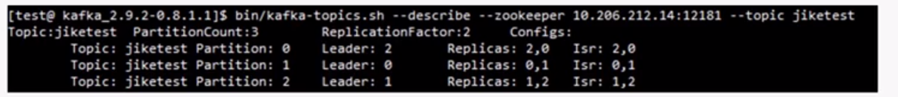

# Kafka 集群维护

> Create Time : 2017年6月20日 Author : huduku.io Ref : 极客学院

* Kafka集群基本信息实时查看和修改
* Kafka集群leader平衡机制
* Kafka集群分区日志迁移

##  Kafka集群基本信息实时查看和修改

集群信息实时查看（topic工具）
* 列出集群当前所有可用的topic：
```
# zookeeper_address = ip:port
bin/kafka-topics.sh --list -zookeeper zookeeper_address
```

* 查看集群特定topic信息
```
bin/kafka-topics.sh --describe --zookeeper zookeeper_address --topic topic_name
```

集群信息实时修改（topic工具）
* 创建topic：
```
bin/kafka-topics.sh --create -zookeeper zookeeper_address --replication-factor 1 --partitions 1 --topic topic_name
```
* 增加（不能减少）partition（最后的4是增加后的值）：
```
bin/kafka-topics.sh  -zookeeper zookeeper_address --alter --topic topic_name  --partitions 4
```

Topic-lever configuration 配置都能修改

## Kafka集群leader平衡机制

每个partition的所有replicas叫做“assigned replicas”，“assigned replicas”中第一个replicas叫做“prefered replica”，刚创建的topic一般“prefered replica”是leader。下图中Partition 0的broker 2 就是prefered replica，默认会成为该分区的leader：



集群leader平衡：
```
bin/kafka-prefered-replica-election.sh --zookeeper zookeeper_address 
auto.leader.rebalance.enable=true
```

## 集群分区日志迁移

迁移topic数据到其他broker，请遵循下面四步：
* 写json文件,文件格式如下：
```
cat topics-to-move.json
{
    "topics":[{"topic":"foo1"},{"topic":"foo2"}],
    "version":1
}
```

* 使用-generate生成迁移计划（下面的操作是将topic:foo1和foo2移动到broker 5，6）：
```
bin/kafka-reassign-partitions.sh --zookeeper localhost:2181 --topics-to-move-json-file topics-to-move.json --broker-list "5,6" -generate
# 这一步只是生成计划，并没有执行数据迁移
```

* 使用-execute执行计划
```
bin/kafka-reassign-partitions.sh --zookeeper localhost:2181 --reassignment-json-file expand-cluster-reassignment.json -execute
#执行前，最好保存当前的分配情况，以防出错回滚
```

* 使用-verify验证是否已经迁移完成
迁移某个topic的某些特定的partition数据到其他broker，步骤与上面一样，但是json文件如下面所示：
```
cat custom-reassignment.json
{
    "version":"1",
    "partitions":[{"topic":"foo1","partition":"0","replicas":[5,6]},
        {"topic":"foo2","partition":"1","replicas":[2,3]}
    ]
}
```

```
bin/kafka-reassign-partition.sh --zookeeper zookeeper_address --reassignment-json-file expand-cluster-reassignment.json --verify
```

可以指定到topic的分区编号：

kafka-reassign-partitions.sh工具会复制磁盘上的日志文件，只有当完全复制完成，才会删除迁移钱磁盘上的日志文件。执行分区日志迁移需要注意：
* kafka-reassig-partitions.sh工具粒度只能到broker，不能到broker的目录，（如果broker上配置了多个目录，是按照磁盘上面已经驻留的分区数来平均分配的），所以，如果topic之间的数据，或者topic的partition之间的数据本身就不均匀，很有可能造成磁盘数据的不均匀：
* 对于分区数据较多的分区迁移会花大量的时间，所以建议在topic数据量较少或磁盘有效数据较少的情况下执行数据迁移操作
* 进行分区迁移时，最好先保留一个分区在原来的磁盘，这样不会影响正常的小芬和生产，如果目的是将分区5（broker 1，5）迁移到broker 2，3.可以先将5迁移到2，1，最后再迁移到2，3.而不是将1，5迁移到2，3.因为一次迁移所有的副本，无法正常消费和生成，部分迁移则可以正常消费和生产。


