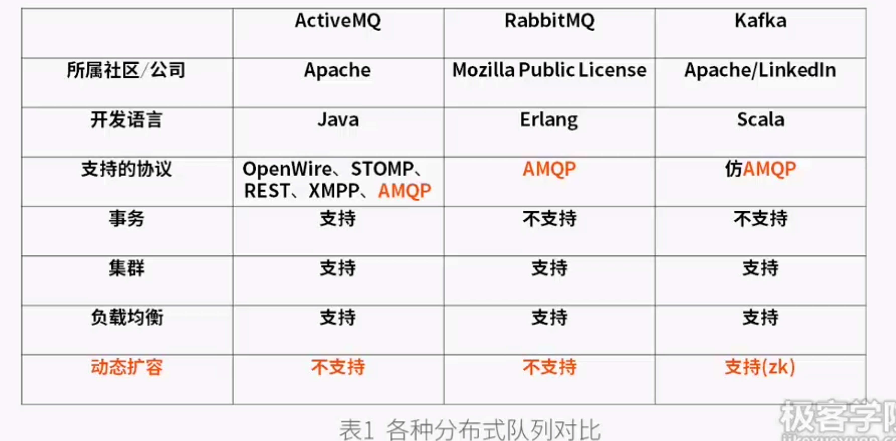
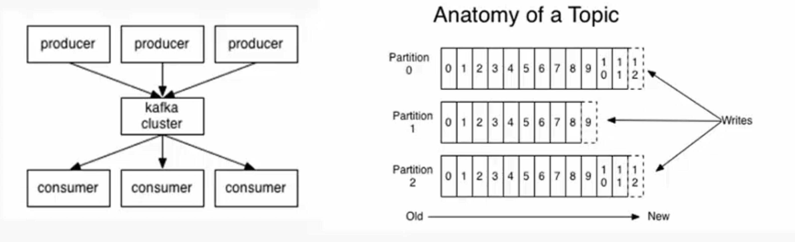
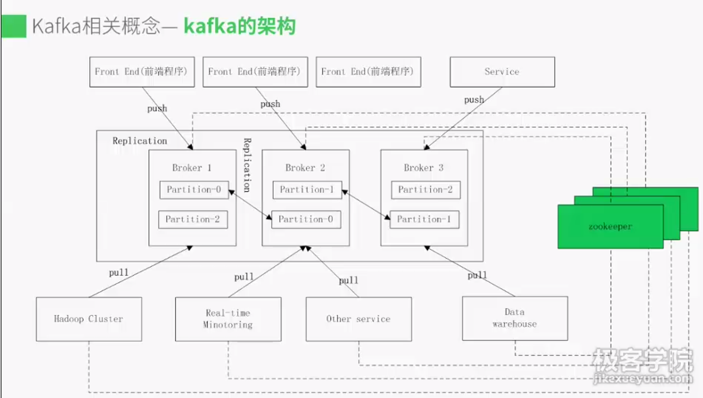

# Kafka

> Create Time : 2017年6月19日 Author : huduku.io 源自极客学院


## Kafka 使用背景

Kafka定义： Kafka是一个分布式消息系统，由LinkedIn使用Scala编写，用作LinkedIn的活动流（Activity Stream）和运营数据出来管道（Pipline）的基础，具有高水平扩展和高吞吐量。

应用领域： 已被多家不同类型的公司作为多种类型的数据管道和消息系统使用。如：淘宝，支付宝，百度，twitter等。

目前，越来越多的开源分布式处理系统如Apache Flume ， Apache Storm，Spark，ElasticSearch都支持与Kafka集成。

开源分布式消息系统对比：



## Kafka 相关概念

### AMQP协议

```
            push             pull
 producer ------- > broker <-------- consumer
```

一些基本概念：
* 消费者consumer： 从消息队列中请求消息的客户端应用程序
* 生产者producer： 向broker发布消息的客户端应用程序
* AMQP服务器端broker：用来接受生产者发送的消息并经这些消息路由给服务器中的队列。

### Kafka支持的客户端语言

Kafka客户端支持当前大部分主流语言：包括C、C++、Erlang、Java、.net、perl、PHP、Python、Ruby、Go、JavaScript

可以使用以上任何一种语言和Kafka服务器进行通信（即编写自己的consumer和producer程序）。

### Kafka架构



一些基本概念
* 主题Topic： 一个主题类似新闻中体育、娱乐、教育等分类概念，在实际工程中通常一个业务一个主题。
* 分区Partition：一个topic中的消息数据按照多个分区组织，分区是kafka消息队组织中的最小单位，一个分区可以看作是一个FIFO的队列。




## Zookeeper 集群搭建

### 集群搭建

软件环境： 
* Linux服务器奇数台
* JDK1.7
* zookeeper-3.4.6

zookeeper搭建过程：

集群配置参数：
重要配置：
* myid文件和server.myid=ip:2888:3888
* zoo.cfg文件
* log4j.properties 文件
* zkEnv.sh 和 zkServer.sh
* zkCli.sh

zoo.cfg:
* tickTimer=2000  : 
* initLimit=10 : 
* syncLimit=0
* datadir
* dataLogDir


### 集群配置参数介绍

软件环境：
* Linux服务器一台或多台
* 已经搭建好zookeeper集群
* kafka_2.9.2-0.8.1.1
启动kafka集群命令:


集群配置参数

server.properties
consumer.properties
producer.properties


