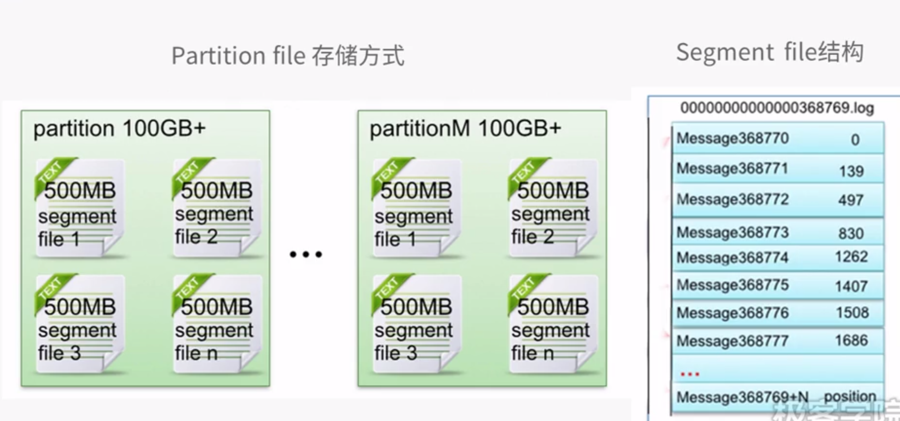
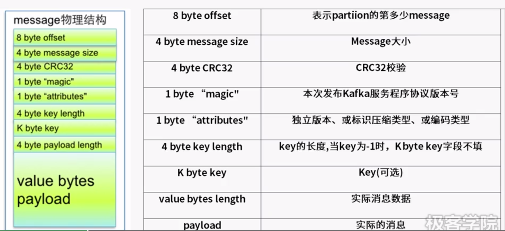
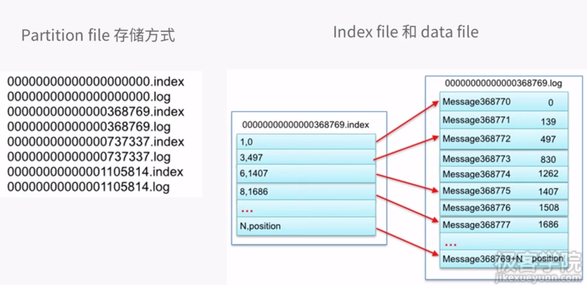

# Kafka消息检索原理

> Create Time : 2017年6月20日 Author : huduku.io Ref : 极客学院

* Kafka消息的segment file的组成和物理结构
* Kafka消息的index file的组成和物理结构
* Kafka消息检索过程

## Kafka消息的segment file的组成和物理结构

以读取offset=368769的message为例，需要通过下面2个步骤查找：
* 第一步查找segment file：
以上图为例，其中00000000000000000000.index表示最开始的文件,起始偏移量(offset)为0.第二个文件0000000000000368769.index的消息量起始偏移量为368770=368769+1.只要根据offset二分查找文件列表,就可以快速定位到具体的文件.当offset=368776时,定位到0000000000000368769.index|log . 
* 第二步通过segment file查找message
算出368776-368770=6,取0000000000000368769.index文件第三项(6,1407),得出从定位到0000000000000368769.log文件头偏移1407字节读取一条消息即可.

