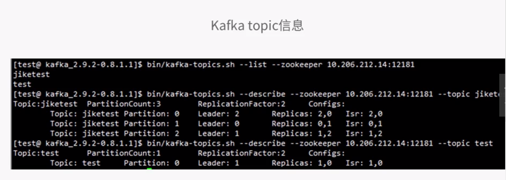
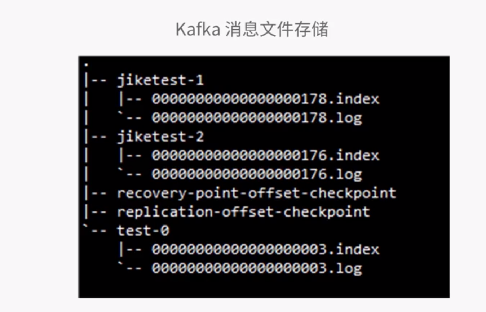
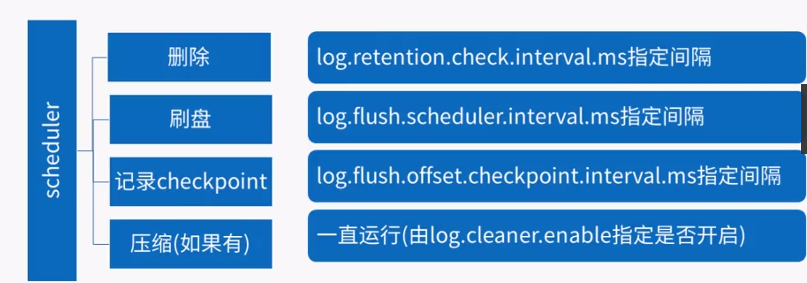

# Kafka 消息组织原理

> Create Time : 2017-06-20 Author : huduku.io Ref : 极客学院

## 磁盘重认识

当需要从磁盘读取数据时，需要确定读的数据在哪个磁道，哪个扇区：
* 首先，必须找到柱面，即磁头需要移动对准相应磁道，这个剁成叫做寻道，所耗费时间叫做寻道时间。
* 然后目标扇区旋转到磁头下，这个过程耗费的时间叫做旋转时间。
一次访盘请求（读/写）完成过程由三个动作组成：
* 寻道时间： 磁头移动定位到指定磁道。
* 旋转延迟时间：等待指定扇区从磁头下旋转经过。
* 数据传输时间：数据在磁盘、内存与网络之间的实际传输。 
由于存储介质的特性，磁盘本身存取就比主存慢，再加上机械运动耗费，磁盘的存取速度往往是主存的几百分之一甚至几千分之一。

根据数据的局部性原理，有以下两种方法提升速度：
* 预读或者提前读。
* 合并写--将多个逻辑上的写操作合并成一个大的物理写操作。

即采用磁盘顺序读写（不需要寻道时间，只需要很少的旋转时间）。实验结果：在一个67200rpm stat raid-5的磁盘阵列上线性写的速度大概是300M/S，但是随机写的速度只有50K/S，两者相差将近10000倍。


## Kafka消息的写入原理

一般将数据从文件传到套接字的路径：
* 操作系统将数据从磁盘读到内核空间的页缓存中。
* 应用将数据从内核空间读到用户空间的缓存中---------------------
* 应用将数据写回内存空间的套接字缓存中--------------------------
* 操作系统将数据从套接字缓存写到网卡缓存中，以便将数据经网络发出

这样做明显是低效的，这里有四次拷贝，两次系统调用。如果使用sendfile（Java为FileChannel.transferTo api），两次拷贝可以被避免：允许操作系统将数据直接从页缓存发送到网络上。优化后，只有最后一部将数据拷贝到网卡缓存中是需要的。

```
   数据写入和读出的Byte Zero Copy

生产 ： 网络------> pagecache------------> 磁盘


消费 ： 磁盘-------------------> 网络

```





## Kafka消息的删除原理

从最久的日志段开始删除（按照日志段为单位进行删除），然后逐步向前推进，知道某个日志段不满足条件为止，删除条件：
* 满足给定条件predicate（配置项log.retention.(ms,minutes,hours)和 log.retention.bytes）
* 不能是当前激活的日志段
* 大小不能小于日志段的最小大小（配置项 log.segment.bytes配置） (只会出现在当前激活的日志段)
* 要删除的是不是所有日志段，如果是的话直接调用roll方法进行切分，因为Kafka至少要保留一个日志段。




