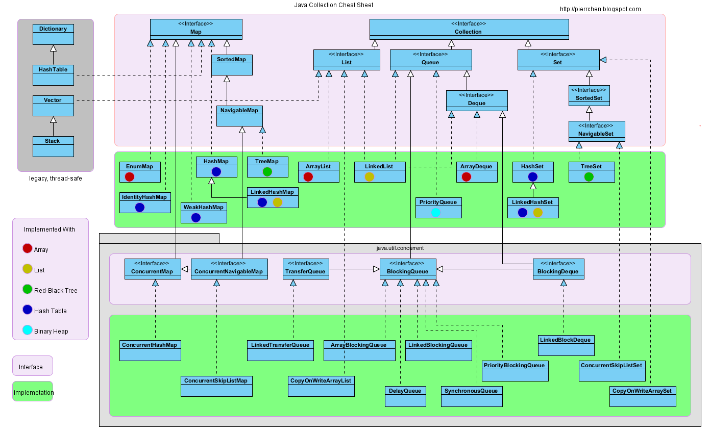

# Map-HashMap-TreeMap-LinkedHashMap

> Create Time : 2017年3月6日   Ref : http://stackoverflow.com/questions/2889777/difference-between-hashmap-linkedhashmap-and-treemap

```
    ╔══════════════╦═════════════════════╦═══════════════════╦═════════════════════╗
    ║   Property   ║       HashMap       ║      TreeMap      ║     LinkedHashMap   ║
    ╠══════════════╬═════════════════════╬═══════════════════╬═════════════════════╣
    ║              ║  no guarantee order ║ sorted according  ║                     ║
    ║   Order      ║ will remain constant║ to the natural    ║    insertion-order  ║
    ║              ║      over time      ║    ordering       ║                     ║
    ╠══════════════╬═════════════════════╬═══════════════════╬═════════════════════╣
    ║  Get/put     ║                     ║                   ║                     ║
    ║   remove     ║         O(1)        ║      O(log(n))    ║         O(1)        ║
    ║ containsKey  ║                     ║                   ║                     ║
    ╠══════════════╬═════════════════════╬═══════════════════╬═════════════════════╣
    ║              ║                     ║   NavigableMap    ║                     ║
    ║  Interfaces  ║         Map         ║       Map         ║         Map         ║
    ║              ║                     ║    SortedMap      ║                     ║
    ╠══════════════╬═════════════════════╬═══════════════════╬═════════════════════╣
    ║              ║                     ║                   ║                     ║
    ║     Null     ║       allowed       ║    only values    ║       allowed       ║
    ║ values/keys  ║                     ║                   ║                     ║
    ╠══════════════╬═════════════════════╩═══════════════════╩═════════════════════╣
    ║              ║   Fail-fast behavior of an iterator cannot be guaranteed      ║
    ║   Fail-fast  ║ impossible to make any hard guarantees in the presence of     ║
    ║   behavior   ║           unsynchronized concurrent modification              ║
    ╠══════════════╬═════════════════════╦═══════════════════╦═════════════════════╣
    ║              ║                     ║                   ║                     ║
    ║Implementation║      buckets        ║   Red-Black Tree  ║    double-linked    ║
    ║              ║                     ║                   ║       buckets       ║
    ╠══════════════╬═════════════════════╩═══════════════════╩═════════════════════╣
    ║      Is      ║                                                               ║
    ║ synchronized ║              implementation is not synchronized               ║
    ╚══════════════╩═══════════════════════════════════════════════════════════════╝

```

