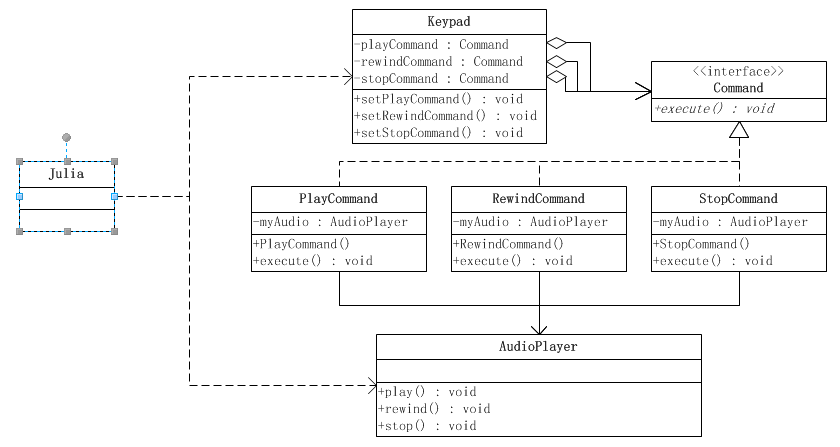

# 命令模式

> Create Time : 2017年6月23日 Author : huduku.io  Ref : http://www.cnblogs.com/java-my-life/archive/2012/06/01/2526972.html

在阎宏博士的《JAVA与模式》一书中开头是这样描述命令（Command）模式的：

> 命令模式属于对象的行为模式，命令模式又称为行动（Action）或者交易（Transaction）模式。命令模式把一个请求或者操作封装到一个对象中，命令模式允许系统使用不同的请求把客户端参数化，对请求排队或者记录请求日志，可以提供命令的撤销和恢复功能。

## 命令模式的结构

命令模式是对命令的封装，命令模式把发出命令的责任和执行命令的责任分开，委派给不同的对象。

每一个命令都是一个操作：请求的一方发出请求要求执行一个操作；接收的一方收到请求，并执行操作。命令模式允许请求的一方和接收的一方独立开来，使得请求的一方不必知道接收请求的一方的接口，要不必知道请求是怎么被接受，以及操作是否被执行、何时被执行，以及是怎么被执行的。

命令允许请求的一方和接收的一方能够独立演化，从而具有以下的有点：

1. 命令模式使新的命令很容易的被加入到系统里。
2. 允许接收请求的一方决定是否要否决请求。
3. 能较容易的设计一个命令队列。
4. 可以容易地实现对请求的撤销和恢复。
5. 在需要的情况下，可以容易的将命令记入日志。

下面一个示意性的系统，说明命令模式的结构。


命令模式涉及到的五个角色，他们分别是：

* `客户端（Client）角色` - 创建一个具体命令（ConcreteCommand）对象并确定其接收者。
* `命令（Command）角色` - 声明一个给所有具体命令类的抽象接口。
* `具体命令（ConcreteCommand）角色` - 定义一个接收者和行为之间的弱耦合；实现execute()方法，负责调用接收者的相应操作，execute()方法通常叫做执行方法。
* `请求者（Invoker）角色` - 负责调用命令对象执行请求，相关的方法叫做行动方法。
* `接收者（Receiver）角色` - 负责具体实施和执行一个请求，任何一个类都可以成为接收者，实施和执行请求的方法叫做行动方法。

## 源代码

接收者角色类

```Java
public class Receiver {
    /**
     * 真正执行命令的操作
     **/
    public void action() {
        System.out.println("执行操作");
    }
}
```

抽象命令角色类

```Java
public interface Command {
    /**
     * 执行方法
     **/
    void execute();
}
```

具体命令角色类

```Java
public class ConcreteCommand implements Command {
    //持有相应的接收者对象
    private Receiver receiver;

    /**
     * 构造方法
     **/
    public ConcreteCommand(Receiver receiver) {
        this.receiver = receiver;
    }

    @Override
    public void execute() {
        //通常会转调接收者对象的相应方法，让接收者来真正执行功能
        receiver.action();
    }
}
```

请求角色类

```Java
public class Invoker {
    /**
     * 持有命令对象
     **/
    private Command command ;

    /**
     * 构造方法
     **/
    public Invoker(Command command) {
        this.command = command;
    }

    /**
     * 行动方法
     **/
    public void action(){
        command.execute();
    }
}
```

```Java
public class Client {
    public static void main(String[] args) {

        //创建接收者对象
        Receiver receiver = new Receiver();
        //创建命令对象，设定它的接收者
        Command command = new ConcreteCommand(receiver);
        //创建接收者，把命令对象设置进去
        Invoker invoker  = new Invoker(command);
        //执行方法
        invoker.action();
    }
}
```

## 应用场景 AudioPlayer系统

小女孩朱莉（Julia）有一个盒式录音机，此录音机有播音（Play）、倒带（Rewind）和停止（Stop）功能，录音机的键盘便是请求者（Invoker）角色；朱莉是客户端角色，而录音机是接收者角色。Command类扮演抽象命令角色，而PlayCommand、StopCommand和RewindCommand则是具体的命令类。朱莉不需要知道播音（Play）、倒带（Rewind）和停止（Stop）功能是怎么具体执行的，这些命令执行的细节全都由键盘（Keypad）具体实施。朱莉只需要在键盘上按下相应键便可以了。

录音机是典型的命令模式。录音机按键把客户端与录音机的操作细节分割开来。



## 源代码

接收者角色，由录音机扮演

```Java
public class AudioPlayer {
    public void play(){
        System.out.println("播放...");
    }

    public void rewind(){
        System.out.println("倒带...");
    }

    public void stop(){
        System.out.println("停止...");
    }
}
```

抽象命令类

```Java

public interface Command {
    /**
     * 执行方法
     **/
    public void execute();
} 
```

具体命令角色类

```Java
public class PlayCommand {
    private AudioPlayer myAudio;
    public PlayCommand(AudioPlayer audioPlayer) {
        myAudio = audioPlayer;
    }

    /**
     * 执行方法
     **/
    public void execute(){
        myAudio.play();
    }
}

```

```Java
public class RewindCommand {
    private AudioPlayer myAudio;
    public RewindCommand (AudioPlayer audioPlayer) {
        myAudio = audioPlayer;
    }

    @Override
    public void execute(){
        myAudio.rewind();
    }
}
```

```Java
public class StopCommand implements Command {
    private AudioPlayer myAudio;
    public StopCommand(AudioPlayer audioPlayer) {
        myAudio = audioPlayer;
    }

    @Override
    public void execute() {
        myAudio.stop();
    }
}
```

请求者角色，由键盘类扮演

```Java
public void KeyPad {
    private Command palyCommand;
    private Command rewindCommand;
    private Command StopCommand;

    public void setPlayCommand(Command palyCommand) {
        this.playCommand = palyCommand;
    }

    public void setRewindCommand(Command rewindCommand) {
        this.rewindCommand = rewindCommand;
    }

    public void setStopCommand(Command stopCommand) {
        this.stopCommand = stopCommand;
    }

    /**
     *  执行播放方法
     **/
    public void play(){
        playCommand.execute();
    }

    /**
     * 执行倒带方法
     **/
    public void rewind(){
        rewindCommand.execute();
    }

    /**
     * 执行播放方法
     **/
    public void stop(){
        stopCommand.execute();
    }
}
```

客户端角色，由朱莉小女孩扮演

```Java
public class Julia {
    public static void main(String[] args) {
        //创建接收者对象
        AudioPlayer audioPlayer = new AudioPlayer();
        //创建命令对象
        Command playCommand = new PlayCommand(audioPlayer);
        Command rewindCommand = new RewindCommand(audioPlayer);
        Command stopCommand = new StopCommand(audioPlayer);

        //创建请求者对象
        KeyPad keyPad = new keyPad();
        keyPad.setPlayCommand(playCommand); 
        keyPad.setRewindCommand(rewindCommand);
        keyPad.setStopCommand(stopCommand);

        //测试
        keyPad.paly();
        keyPad.rewind();
        keyPad.stop();

        keyPad.paly();
        keyPad.stop();
    }
}
```

## 宏命令

所谓宏命令 - 简单点说，就是包含多个命令的命令，是一个命令的组合。

设想朱莉的录音机功能，可以把一个一个的命令记录下来，再在任何需要的时候重新把这些记录下来的命令一次性执行，这就是所谓的宏命令集功能。因此，朱莉的录音机系统现在有四个键，分别是播音，倒带，停止和宏命令功能。此时系统的设计与前面的设计相比有所增强，主要体现在Julia类现在有了一个新方法，用以操作用命令键 。


## 源代码

系统需要一个代表宏命令的接口，以定义出具体的宏命令所需要的接口。

```Java
public interface MacroCommand extends Command {
    /**
     * 宏命令聚集的管理办法
     * 可以添加一个成员命令
     **/
    public void add(Command command);

    /**
     * 宏命令聚集管理方法
     * 可以删除一个成员命令
     **/
    public void remove(Command command);
}
```


具体宏命令MacroAudioCommand 类负责把个别的宏命令合成宏命令。

```Java
public class MacroAudioCommand implements MacroCommand {
    private List<Command> commandList = new ArrayList<Command>();
    /**
     * 宏命令聚集管理方法
     * 添加命令
     **/
    public void add(Command command) {
        commandList.add(command);
    }

    /**
     * 宏命令聚集管理办法
     * 删除命令
     **/
    @Override
    public void remove(Command command) {
        commandList.remove(command);
    }  

    /**
     * 执行方法
     **/
    public void execute() {
        for (Command cmd : commandList) {
            cmd.execute();
        }
    }
    
}
```

客户端类Julia

```Java
public class Julia {
    public static void main(String[] args) {
        //创建接收者对象
        AudioPlayer audioPlayer = new AudioPlayer();
        //创建命令对象
        Command playCommand = new PlayCommand(audioPlayer);
        Command rewindCommand = new RewindCommand(audioPlayer);
        Command stopCommand = new StopCommand(audioPlayer);

        MacroCommand macroCommand = new MacroAudioCommand();

        macroCommand.add(playCommand);
        macroCommand.add(rewindCommand);
        macroCommand.add(stopCommand);
        macroCommand.execute();
    }
}
```

## 命令模式的优点

* 更松散的耦合
命令模式使得发起命令的对象-客户端，和具体实现命令的对象-接收者对象完全解耦，也就是说发起命令的对象完全不知道具体实现对象是谁，也不知道该如何实现。
* 更动态的控制
命令模式把请求封装起来，可以动态地对它进行参数化，队列化和日志化等操作，从而使得系统更灵活。
* 很自然的复合命令
命令模式中的命令对象能够很容易地组合成符合命令，也就是宏命令，从而使系统操作更简单，功能更强大。
* 更好的扩展性
由于发起命令的对象和具体的实现完全解耦，因此扩展新的命令就很容易，只需要实现新的命令对象，然后在装配的时候，把具体的实现对象设置到命令对象中，然后就可以使用这个命令对象，对已有的实现完全不用变化。


