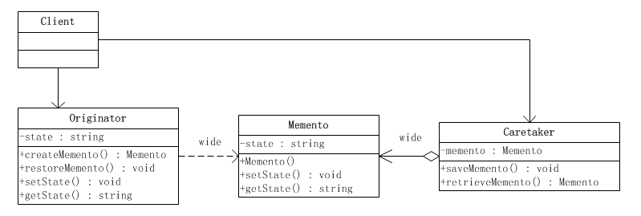

# 备忘录模式

> Create Time : 2017年6月23日 Author : huduku.io Ref : http://www.cnblogs.com/java-my-life/archive/2012/06/06/2534942.html

在阎宏博士的《JAVA与模式》一书中开头是这样描述备忘录（Memento）模式的：

> 备忘录模式又叫做快照模式（SnapShot Pattern）或Token模式，是对象的行为模式。

> 备忘录对象是一个用来存储另一个对象内部状态的快照对象，备忘录模式的用意是在不破坏封装的条件下，将一个对象的状态捕捉（Capture）住，并外部化，存储起来，从而可以在将来合适的时候把这个对象还原到存储起来的状态。备忘录模式常常与命令模式和迭代子模式一同使用。

## 备忘录模式的结构

如图：


备忘录模式所涉及到的角色有三个：备忘录角色（Memento），发起人角色（Originator），负责人角色（Caretaker）。

* `备忘录角色`：
    1. 将发起人对象的内部状态存储起来，备忘录可以根据发起人对象的判断来决定存储多少发起人对象的内部状态。
    2. 备忘录可以保护其内容不被发起人对象之外的任何对象所读取。
    3. 备忘录角色有两个等效的接口：
        * `窄接口` - 负责人对象（和其他除发起人对象之外的任何对象）看到的是备忘录的窄接口（narrow interface），这个窄接口只允许它把备忘录对象传给其他的对象。
        * `宽接口` - 与负责人对象看到的窄接口相反的是，发起人对象可以看到一个宽接口（wide interface），这个宽接口允许它读取所有的数据，以便根据这些数据恢复这个发起人对象的内部状态。
* `发起人角色` ：
    1. 创建一个含有当前内部状态的备忘录对象。
    2. 使用备忘录对象存储其内部状态。
* `负责人角色` ：
    1. 负责保存备忘录对象。
    2. 不检查备忘录对象的内容。

## 白箱备忘录模式的实现

备忘录角色对任何对象都提供一个接口，即宽接口，备忘录角色的内部所存储的状态就对所有对象公开。因此这个实现又叫做“白箱实现”。

“白箱”实现将发起人角色的状态存储在一个大家都看得到的地方，因此是破坏封装性的。但是通过程序员自律，同意可以在一定程度上实现模式的大部分用意。因此白箱实现仍然是有意义的。

下面给出一个示意性的“白箱实现”：



## 源代码
发起人角色类，发起人角色利用一个新创建的备忘录对象将自己的内部状态存储起来。
```Java
public class Originator {
    private String state;
    /**
     * 工厂方法，返回一个新的备忘录对象
     **/
    public Memento createMemento(){
        return new Memento(state);
    }

    /**
     * 将发起人恢复到备忘录对象所记载的状态
     **/
    public void restoreMemento(Memento memento) {
        this.state = memento.getState();
    }

    public String getState(){
        return state;
    }

    public void setState(String state) {
        this.state = state;
        System.out.println("当前状态：" + this.state);
    }
}
```

备忘录角色类,备忘录对象将发起人对象传入的状态存储起来。

```Java
public class Memento {
    private String state;
    public Memento(String state){
        this.state = state;
    }
    public String getState(){
        return state;
    }
    public void setState(String state){
        this.state = state;
    }
}
```

负责人角色类，负责人角色负责保存备忘录对象，但是从不修改（甚至不查看）备忘录对象的内容。

```Java
public class Caretaker {
    private Memento memento;
    /**
     * 备忘录取值方法
     **/
    public Memento retrieveMemento(){
        return this.memento;
    }

    /**
     * 备忘录的赋值方法
     **/
    public void saveMemento(Memento memento) {
        this.memento = memento;
    }
}
```

客户端角色类

```Java
public class Client {
    public static void main(String[] args) {
        Originator o = new Originator();
        Caretaker c = new Caretaker();
        //改变负责人对象的状态
        o.setState("On");
        //创建备忘录对象，并将发起人对象的状态存储起来
        c.saveMemento(o.createMemento());
        //修改发起人的状态
        o.setState("Off");
        //恢复发起人对象的状态
        o.restoreMemento(c.retrieveMemento());
        System.out.println(o.getState());
    }
}
```

在上面的这个示意性的客户端角色里面，首先将发起人对象的状态设置为“On”，并创建一个备忘录对象将这个状态存储起来；然后将发起人对象的状态改成“off”；最后将发起人对象回复到备忘录对象所存储起来的状态，即“On”状态。

系统的时序图更能够反映出系统各个角色被调用的时间顺序，如下图是将发起人对象的状态存储到白箱备忘录中去的时序图。


可以看出系统运行的时序是这样的：
1. 将发起人对象的状态设置成“On”
2. 调用发起人角色的createMemento()方法，创建一个备忘录对象将这个状态存储起来。
3. 将备忘录对象存储到负责人对象中去。

将发起人对象回复到备忘录对象所记录的状态的时序图如下所示：


可以看出，将发起人对象回复到备忘录对象所记录的状态时，系统运行的时序是这样的：
1. 将发起人状态设置成“Off”
2. 将备忘录对象从负责人对象中取出
3. 将发起人对象恢复到备忘录对象所存储起来的状态，即“On”状态。

## “黑箱”备忘录模式的实现

备忘录角色对发起人（originator）角色对象提供一个宽接口，而为其他对象提供一个窄接口。这样的实现叫做黑箱实现。

在Java语言中，实现双重接口的办法是将备忘录角色类设计成发起人角色类的内部成员类。

将Memento设成Originator类的内部类，从而将Memento对象封装在Originator里面；在外部提供一个标准接口MementoIF给Caretaker以及其他对象。这样，Originator类看到的是Memento的所有接口，而Caretaker以及其他对象看到的仅仅是标识接口MementoIF所暴露出来的接口。

使用内部类实现备忘录模式的类图如下：


## 源代码

发起人角色类Originator中定义了一个内部的Memento类，由于此Memento类的全部接口都是私有的，因此只有它自己和发起人可以调用。

```Java
package memento.sample2;

/**
 * 发起人角色
 **/
 public class Originator {
     private String state;
     public String getState(){
         return state;
     }
     public void setState(String state){
        this.state = state;
        System.out.println("赋值状态: " + state);
     }
     /**
      * 工厂方法，返还一个新的备忘录对象
      **/
     public MementoIF createMemento(){
         return new Memento(state);
     }

     /**
      * 发起人恢复到备忘录对象记录的状态
      **/
     public void restoreMemento(MementoIF memento) {
         this.setState(((Memento)memento).getState());
     } 

     private class Memento implements MementoIF {
         private String state;
         /**
          * 构造方法
          **/
         public Memento(String state) {
             this.state = state ;
         }

         public String getState(){
             return state;
         }
        
         private void setState(String state) {
             this.state = state;
         }
     }
 }
```

窄接口MementoIF，这是一个标识接口，因此它没有定义出任何的方法。

```Java
public interface MementoIF {

}
```

负责人角色Caretaker能够得到的备忘录对象是以MementoIF为接口的，由于这个接口仅仅是一个标识接口，因此负责人不可能改变这个备忘录对象的内容。

```Java
public class Caretaker {
    private MementoIF memento;
    /**
     * 备忘录取值办法
     **/
    public MementoIF retrieveMemento(){
        return memento;
    }

    public void setMemento(MenmentoIF memento) {
        this.memento = memento;
    }
}
```

客户端角色类

```Java
public class Client {
    public static void main(String[] args) {
        Originator o = new Originator();
        Caretaker c = new Caretaker();
        //改变负责人对象的状态
        o.setState("On");
        //创建备忘录对象，并将发起人对象的状态存储起来
        c.saveMemento(o.createMemento());
        //修改发起人对象的状态
        o.setState("Off");
        //恢复发起人对象的状态
        o.restoreMemento(c.retrieveMemento());
    }
}
```

客户端首先：
1. 将发起人对象的状态设置为“On”。
2. 调用createMemento()方法，创建一个备忘录对象将这个状态存储起来（此时，createMemento（）方法返回的额明显类型是MementoIF接口，真实类型为Originator内部的Mementor对象）。
3. 将备忘录对象存储到负责人对象中去，由于负责人对象拿到的MementoIF，因此无法独处备忘录对象内部的状态。
4. 将发起人对象的状态设置为“Off”。
5. 调用负责人对象的retrieveMemento()方法将备忘录对象取出，注意此时仅能得到MementoIF接口，因此无法读出次对象的内部状态。
6. 调用发起人对象的restoreMemeto()方法将发起人对象的状态恢复成备忘录对象所能存储起来的状态，即“On”状态。由于发起人对象的内部类Memento实现了MementoIF接口，这个内部类是传入的备忘录对象的真实类型，因此发起人对象可以利用内部类Memento的私有接口读出此对象的内部状态。

## 多重检查点

前面所给出的白箱和黑箱的示意性实现都是只存储一个状态的简单实现，也可以叫做只有一个检查点，常见的系统汪汪需要存储不止一个状态，而是需要存储多个状态，或者叫有多个检查点。

备忘录模式可以将发起人对象的状态存储到备忘录对象里面，备忘录模式可以将发起人对象恢复到备忘录对象所存储的某一个检查点上。下面给出一个示意性的、有多重检查点的备忘录模式的实现。


## 源代码

发起人角色代码

```Java
public class Originator {
    private List<String> states;

    /**
     * 检查点指数
     **/
    private int index;

    public Originator(){
        states = new ArrayList<>();
        index = 0;
    }

    /**
     * 工厂方法，返还一个新的备忘录对象
     **/
    public Memento createMemento(){
        return new Memento(status , index);
    }

    /**
     * 将发起人恢复到备忘录对象记录的状态上
     **/
    public void restoreMemento(Memento memento) {
        states = memento.getStates();
        index = memento.getIndex();
    }

    public void setState(String state) {
        states.add(state);
        index++;
    }

    /**
     *  辅助方法，打印所有状态
     **/
    public vodi printStatus(){
        for (String state : states){
            System.out.println(state);
        }
    }
}
```

备忘录角色类，这个实现可以存储任意多个状态，外界可以使用检查点指数index来去除检查点上的额状态

```Java
public class Memento {
    private List<String> states;
    private int index;
    /**
     * 构造函数
     **/
    public Mmemento(List<String> states,int index) {
        this.states = new ArrayList(states);
        this.index = index;
    }

    public List<String> getStates(){
        return states;
    }

    public int getIndex(){
        return index;
    }
}
```


负责人角色类

```Java
public class Caretaker {
    private Originator o;
    private List<Memento> mementos = new ArrayList();
    private int current;

    public int createMemento(){
        Memento memento = o.createMemento();
        mementos.add(memento);
        return current++;
    }

    /**
     * 将发起人恢复到某个检查点
     **/
    public void restoreMemento(int index) {
        Memento memento = mementos.getIndex(index);
        o.restoreMemento(memento);
    }

    /**
     * 删除某个检查点
     **/
    public void removeMemento (int index) {
        mementos.remove(index);
    }
}
```

客户端角色源码

```Java
public class Client {
    public static void main(String[] args) {
        Originator o = new Originator();
        Caretaker c = new Caretaker(o);

        o.setState("state 0");
        c.createMemento();

        o.setState("state 1");
        c.createMemento();

        o.setState("state 2");
        c.createMemento();

        o.setState("state 3");
        c.createMemento();

        o.printStatus();
        System.out.println("--------恢复检查点-------");

        c.restoreMemento(2);
        
        o.printStatus();
    }
}
```

可以看出客户端角色通过不断改变发起人的状态，并将之存储在备忘录里面。通过指明检查点指数可以将发起人角色恢复到相应的检查点对应的状态上。

将发起人的状态存储到备忘录对象中的时序图中：


系统运行的时序是这样的：
1. 将发起人对象的状态设置成某个有效的状态。
2. 调用负责人角色的createMemento()方法，负责人角色会负责调用发起人角色和备忘录角色，将发起人对象的状态存储起来。

将发起人对象恢复到某一个备忘录对象的检查点的时序图如下:


由于负责人角色的功能被增强了，因此将发起人对象回复到备忘录对象所记录的状态时，系统的运行时序被简化了：调用负责人角色的 restoreMemento() 方法，将发起人恢复到某个检查点。

## “自述历史”模式

所谓“自述历史”模式（History-On-Self Pattern）实际上就是备忘录模式的一个变种。在备忘录模式中，发起人（Originator）角色，负责人角色（Caretaker）和备忘录角色（Memento）都是独立的角色。虽然实现上备忘录可以成为发起人的内部类成员，但是备忘录仍然作为一个角色的独立意义。在“自述历史”模式里面，发起人角色自己贱人负责人角色。

自述历史模式类图如下:


备忘录角色有如下责任：

1. 将发起人（Originator）对象的内部状态存储起来。
2. 备忘录可以保护其内容不被发起人（Originator）对象之外的任何对象所读取

发起人角色有如下责任：

1. 创建一个含有它当前内部状态的备忘录对象。
2. 使用备忘录对象存储其内部状态。

客户端角色负责保存备忘录对象的责任。

## 源代码

窄接口MementoIF，这是一个标识接口，因此它没有定义出任何的方法。

```Java
public inteface MementoIF {

}
```

发起人角色同时还兼任负责人角色，也就是说他自己负责保持自己的备忘录对象。

```Java
public class Originator {
    public String state;
    public void changeState(String state) {
        this.state = state;
        System.out.println("状态对象改变为： " + state);
    }

    /**
     * 工厂方法，返还一个新的备忘录对象
     **/
    public Memento createMemento(){
        return new Memento(this);
    }

    /**
     * 将发起人回复到备忘录对象所记录的状态上
     **/
    public void restoreMemento(MementoIF memento) {
        Memento m = (Memento)memento;
        changeState(m.state);
    }

    private class Memento implements MementoIF {
        private String state;

        private Memento (Originator o) {
            this.state = o.state;
        }

        private String getState(){
            return state;
        }
    }
}
```

客户端角色

```Java
public class Client{
    public static void main(String[] args) {
        Originator o = new Originator();
        o.changeState("state 0");
        MementoIF memento = o.createMemento();

        o.changeState("state 1");
        o.restoreMemento(memento);
    }
}
```


由于“自述历史”作为一个备忘录模式的特殊实现形式非常简单易懂，它可能是备忘录模式最为流行的实现形式。
