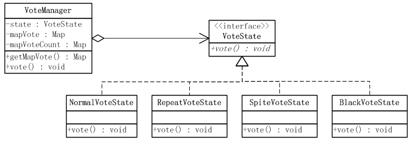
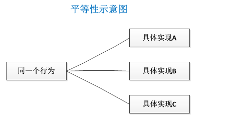

# 状态模式

> Create Time : 2017年6月26日 Author : huduku.io Ref : http://www.cnblogs.com/java-my-life/archive/2012/06/08/2538146.html

在阎宏博士的《JAVA与模式》一书中开头是这样描述状态（State）模式的：

> 状态模式，又称状态对象模式（Pattern of Objects for States），状态模式是对象的行为模式。状态模式允许一个对象在其内部状态改变的时候改变其行为。这个对象看上去像是改变了它的类一样。

## 状态模式的结构

用一句话来说，状态模式把所研究对象的行为包装在不同的状态对象里，每一个状态对象都属于一个抽象状态类的子类。状态模式的意图是让一个对象在其内部状态改变的时候，其行为也随之改变。状态模式的示意性类图如下所示：


状态模式所涉及到的角色有：

* `环境（Context）角色` - 也称上下文：定义客户端所感兴趣的接口，并且保留一个具体状态类的实例。这个具体状态类的实例给出此环境对象的现有状态。
* `抽象状态（State）角色` - 定义一个接口，用以封装环境（Context）对象的一个特定的状态所对应的行为。
* `具体状态（ConcreteState）角色` - 每一个具体状态类都实现了环境（Context）的一个状态对应的行为。

## 源代码

环境角色类

```Java
public class Context {
    //持有一个State类型的对象实例
    private State state;

    public void setState(State state){
        this.state = state;
    }

    /**
     * 用户感兴趣的接口方法
     **/
    public void request(String sampleParameter) {
        //转调state来处理
        state.handle(sampleParameter);
    }
}
```

抽象状态类

```Java
public interface State {
    /**
     * 状态对应的处理
     **/
    public void handle(String sampleParameter);
}
```

具体状态类

```Java
public class ConcreteStateA implements State {
    @Override
    public void handle(String sampleParameter) {
        System.out.println("ConcreteStateA handle : " + sampleParameter);
    }
}
```

```Java
public class ConcreteStateB implements State {
    @Override
    public void handle(String sampleParameter){
        System.out.println("ConcreteStateB handle : " + sampleParameter);
    }
}
```

客户端类

```Java
public class Client {
    public static void main(String[] args) {
        //创建状态
        State state = new ConcreteStateA();
        //创建环境
        Context context = new Context();
        //将状态设置到环境中
        context.setState(state);
        //请求
        context.request("test");
    }
}
```

从上面可以看出，环境类Context的行为request()是委派给某一个具体状态类实现的。通过使用多态性原则，可以动态的改变环境类Context的属性State的内容，使其从指向一个具体状态类变换到指向另一个具体状态类，从而使环境类的行为request()由不同的具体状态类来执行。

## 使用场景

考虑一个在线头片系统的应用，要实现控制同一个用户只能投一票，如果一个用户反复投票，而且投票次数超过5次，则判定为恶意刷票，要取消该用户投票的资格，当然同时也要取消他所投的票；如果一个用户投票次数超过18次，将进入黑名单，禁止再登录和使用系统。

要使用状态模式实现，首先需要把投票过程的各种状态定义出来，根据以上描述大致分为四种状态：正常投票，反复投票，恶意刷票，进入黑名单。然后创建一个投票管理对象（相当于Context）。

系统结构图如下所示:



## 源代码

抽象状态类

```Java
public interface VoteState {
    /**
     * 处理状态对应的行为
     * @param user 投票人
     * @param voteItem 投票项
     * @param voteManager 投票上下文，用来实现状态对应功能处理的时候，可以回调上下文的数据。
     **/
    public void vote(String user,String voteItem,VoteManager voteManager);
}
```

具体状态类--正常投票

```Java
public class NormalVoteState implements VoteState {
    @Override 
    public void vote(String user,String voteItem,VoteManager voteManager) {
        //正常投票，记录到投票记录中
        voteManager.getMapVote().put(user,voteItem);
        System.out.println("恭喜投票成功");
    }
}
```

具体投票类--重复投票

```Java
public class RepeatVoteState implements VoteState {
    @Override
    public void vote (String user,String voteItem,VoteManager voteManager) {
        //重复投票，暂时不做处理
        System.out.println("请不要重复投票");
    }
}
```

具体状态类--恶意刷票

```Java
public class SpiteVoteState implements VoteState {
    @Override
    public void vote (String user,String voteItem,VoteManager voteManager){
        //恶意刷票，取消用户的投票资格，并取消投票记录
        String str = voteManager.getMapVote().get(user);
        if (str != null) {
            voteManager.getMapVote().remove(user);
        }
        System.out.println("恶意刷票，取消投票资格");
    }
}
```

具体状态类--黑名单

```Java
public class BlackVoteState implements VoteState{
    @Override
    public void vote(String user,String voteItem,VoteManager voteManager){
        //记录黑名单中，禁止登录系统
        System.out.println("进入黑名单，将禁止登录和使用本系统");
    }
}
```

环境类

```Java
public class VoteManager {
    //持有状态处理对象
    private VoteState state = null;
    //记录用户投票的结果，Map<String,String>对应Map<用户名称，投票的选项>
    private Map<String,String> mapVote = new HashMap<>();
    //记录用户投票次数，Map<String,Integer> 对应Map<用户名称，投票的次数>
    private Map<String , Integer> mapVoteCount = new HashMap<>();

    /** 
     * 获取用户投票结果的Map
     **/
    public Map<String,String> getMapVote() {
        return mapVote;
    }

    /**
     * 获取用户投票结果的Map
     **/
    public Map<String,String> getMapVote() {
        return mapVote;
    }

    /**
     * 投票
     * @param user 投票人
     * @param voteItem 投票的选项
     **/
    public void vote(String user ,String voteItem) {
        // 1. 为该用户增加投票次数
        // 从记录中取出该用户已有的投票次数
        Integer oldVoteCount = mapVoteCount.get(user);
        if (oldVoteCount == null) {
            oldVoteCount = 0;
        }

        oldVoteCount += 1;

        mapVoteCount.put(user,oldVoteCount);
        //2. 判断用户的投票类型，就相当于判断对应的状态
        // 到底是正常投票，重复投票，恶意刷票还是上黑名单的状态
        if (oldVoteCount == 1) {
            state = new NormalVoteState();
        } else if (oldVoteCount > 1 && oldVoteCount < 5){
            state = new RepeatVoteState();
        } else if (oldVoteCount >= 5 && oldVoteCount <8) {
            state = SpiteVoteState();
        } else if (oldVoteCount > 0){
            state = new BlackVoteState();
        }
        //然后转调状态对象来进行相应的操作
        state.vote(user,voteItem,this);
    }
}
```

客户端类

```Java
public class Client {
    public static void main(String[] args){
        VoteManager vm = new VoteManager();
        for (int i = 0 ; i < 10 ; i++) {
            vm.vote("user1","A")
        }
    }
}
```

从上面可以看出，状态的转换基本上都是内部行为，主要在状态模式内部来维护。比如对于投票人员，任何时候他的操作都是投票，但是投票管理对象却不一定一样，会根据投票的次数来判定状态，然后根据状态选择不同的处理。

## 认识状态模式

* 状态和行为

所谓对象的状态，通常就是对象实例的属性的值；而行为指的是对象的共鞥，再具体点说，行为大多可以对应到方法上。

状态模式的功能就是分离状态的行为，通过维护状态的变化，来调用不同状态对应的不同的功能。也就是说，状态和行为是相关联的，它们的关系可以描述为：`状态决定行为`。

由于状态是在运行期改变的，因此行为也会在运行期根据状态的改变而改变。

* 行为的平行性

注意平行性不是平等性。所谓平行性指的是各个状态的行为所处的层次是一样的，相互独立，没有关联，是根据不同的状态来决定到底走平行线的哪一条。行为是不同的，淡然对应实现也是不同的，相互之间是不可替换的。


而平等性强调的是可替换性，大家都是同一行为的不同描述或实现，因此在同一个行为发生的时候，可以根据条件挑选任意一个实现来进行相应的处理。



大家可能会发现状态模式的结构和策略模式的结构完全一样，但是它们的目的，实现，本质却是完全不一样的。还有行为之间的特性也是状态模式和策略模式一个很重要的区别，状态模式的行为是平行性的，不可相互替换的，而策略模式的行为是平等性的，是可以相互替换的。

* 环境和状态处理对象

在状态模式中，环境（Context）是持有状态的对象，但是环境自身并不处理状态相关的行为，而是把处理状态的功能委托给了状态对应的状态处理类来处理。

在具体的状态处理类中经常要获取环境（Context）自身的数据，甚至在必要的时候会回调环境（Context）的方法，因此，通常将环境（Context）自身作为一个参数传递给具体的状态处理类。

客户端一般只和环境（Context）交互，客户端可以用状态对象来配置一个环境（Context），一旦配置完成，就不再需要和状态对象打交道了。客户端通常不负责运行期间状态的维护，也不负责决定后续到底使用哪一个具体的状态处理对象。


