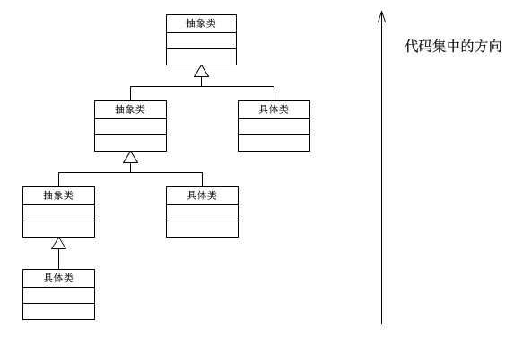

# 策略模式

> Create Time : 2017年6月22日 Author : huduku.io Ref : http://www.cnblogs.com/java-my-life/archive/2012/05/10/2491891.html

《Java 与 模式》之策略模式

在阎宏博士的《Java 与 模式》一书中开头是这样描述策略（Strategy）模式的。

> 策略模式属于对象的行为模式。其用意是针对一组算法，将每一个算法封装到具有共同接口的独立的类中，从而使得他们可以相互替换，策略模式使得算法可以在不影响到客户端的情况下发生变化。

## 策略模式的结构

策略模式是对算法的包装，是把使用算法的责任和算法本身分割开来，委派给不同的对象管理。策略模式通常把一个系列的算法包装到一系列的策略类里面，作为抽象策略类的一个子类。用一句话来说，就是：“准备一组算法，并将每一个算法封装起来，使得他们可以相互替换”。下面以一个示意性的实现讲解策略模式实例的结构。


这个模式涉及到三个角色：

* `环境角色（Context）` - 持有一个Strategy的引用。
* `抽象策略(Strategy)角色` - 这是一个抽象角色，通常由一个接口或抽象类实现。此角色给出所有的具体策略类所需的接口。
* `具体策略（ConcreteStrategy）角色` - 包装了相关的算法或行为。

## 源码

环境角色类:

```
public class Context {
    //持有一个具体策略的对象
    private Strategy strategy;
    /**
     * 构造函数，传入一个具体策略对象
     * @param strategy 具体策略对象
     **/
    public Context(Strategy strategy) {
        this.strategy = strategy;
    }

    /**
     * 环境方法，： 委托给策略对象执行
     **/ 
    public void contextMethod1(){
        strategy.strategyMethod1();
    }
    /**
     * 环境方法，： 委托给策略对象执行
     **/ 
    public void contextMethod2(){
        strategy.strategyMethod2();
    }
    /**
     * 设置替换的策略类
     * @param strategy 
     **/
    public void setStrategy(Strategy strategy) {
        this.strategy = strategy;
    }

}
```

抽象策略类：

```
public interface Strategy {
    /**
     * 策略方法1
     **/
    public void strategyMethod1();

    /**
     * 策略方法2
     **/
    public void strategyMethod2();
}
```

具体策略类：

```
public class ConcreteStrategyA implements Strategy {
    @Override
    public void strategyMethod1(){
        System.out.println("ConcreteStrategyA.strategyMethod1");
    }

    Override
    public void strategyMethod2(){
        System.out.println("ConcreteStrategyA.strategyMethod2");
    }
}
```

```
public class ConcreteStrategyB implements Strategy {
    @Override
    public void strategyMethod1(){
        System.out.println("ConcreteStrategyB.strategyMethod1");
    }

    Override
    public void strategyMethod2(){
        System.out.println("ConcreteStrategyB.strategyMethod2");
    }
}
```

客户端:

```
public class TestStrategy {
    public static void main(String[] args) {
        Context context = new Context(new ConcreteStrategyA());
        context.contextMethod1();
        //设置替换的具体策略
        context.setStrategy(new ConcreteStrategyA());
        context.contextMethod1();
        context.contextMethod2();
    }
}

//执行结果
ConcreteStrategyA.strategyMethod1
ConcreteStrategyB.strategyMethod1
ConcreteStrategyB.strategyMethod2
```


## 使用场景

假设现在要设计一个贩卖各类书籍电子上午网站的购物车系统。一个简单的情况就是把所有货品的单价乘上数量，但是实际情况肯定比这要复杂。比如，本网站可能对所有高级会员提供每本80%的促销折扣；对中级会员提供每本90%的促销折扣；对初级会员没有折扣。

根据描述，折扣是根据以下的几个算法中的一个进行的：
* 算法一 ： 对初级会员没有折扣。
* 算法二 ： 对中级会员提供90%的促销折扣。
* 算法三 ： 对高级会员提供80%的促销折扣。

使用策略模式来实现的结构图如下：


源代码 ： 

抽象会员类

```
public interface MemberStrategy {
    /**
     * 计算图书的价格
     * @param bookprice 图书的原价
     * @ return 计算出打折后的价格
     **/
    public double calcPrice(double bookPrice);
}
```

初级会员折扣类

```
public class PrimaryMemberStrategy implements MemberStrategy {
    @Override
    public double calcPrice(double bookPrice) {
        System.out.println("对于初级会员的折扣");
        return bookPrice ;
    }
}
```

中级会员折扣类

```
public class IntermediateMemberStrategy implements MemberStrategy {
    @Override
    public double calcPrice(double bookPrice) {
        System.out.println("对于中级会员的折扣 90%");
        return bookPrice * 0.9;
    }
}
```

高级会员折扣类

```
public class AdvancedMemberStrategy implements MemberStrategy {
    @Override
    public double calcPrice(double bookPrice) {
        System.out.println("对于高级会员折扣为80%");
        return bookPrice * 0.8;
    }
}
```

价格类:

```
public class Price {
    //持有一个具体的策略对象
    private MemberStrategy strategy;

    /**
     * 构造函数 ， 传入一个具体的策略对象
     * @param strategy 具体的策略对象
     **/
    public Price(Strategy strategy) {
        this.strategy = strategy;
    }

    /**
     * 计算图书的价格
     * @param bookPrice 图书的原价
     * @return 计算打折后的价格
     **/
    public double quote(double bookPrice){
        return this.strategy.calcPrice(bookPrice);
    }

    /**
     *  替换策略对象的算法
     **/ 
    public void setStrategy(Strategy strategy) {
        this.strategy = strategy;
    }
}
```

客户端:

```
public class Client {
    public static void main(String[] args) {
        MemberStrategy strategy = new AdvancedMemberStrategy();
        //创建环境
        Price price = new Price(strategy);
        //计算价格
        double quote = price.quote(300);
        System.out.println("图书的最终价格为: " + quote);

        price.setStrategy(new PrimaryMemberStrategy());
        quote = price.quote(100);
        System.out.println("图书的最终价格为: " + quote);
    }
}
//运行结果
图书的最终价格为: 240
图书的最终价格为: 100
```

从上面的示例可以看出，策略模式仅仅封装算法，提供新的算法插入到已有系统中，以及老算法从系统中“退休”的方法。策略模式并不决定在何时使用何种算法。在什么情况下使用什么算法是由客户端决定的。

## 认识策略模式

策略模式的重心：

策略模式的重心不是如何实现算法，而是如何组织、调用这些算法，从而让程序结构更灵活，具有更好的维护性和扩展性。

算法的平等性：

策略模式的一个很大的特点就是哥哥策略算法的平等性。对于一系列具体的策略算法，大家的地位完全是一样的，正因为这个平等性，才能实现算法之间可以相互替换。所有策略算法在实现上也是相互独立的，相互之间是没有依赖的。

所以可以这样描述这一系列策略算法：策略算法是相同行为的不同实现。

运行时策略的唯一性：

运行期间，策略模式在每一个时刻只能使用一个具体的策略实现对象，虽然可以动态的在不同的策略实现中切换，但是同时只能使用一个。

公有的行为

经常见到的是，所有的具体策略类都有一些公有的行为。这时候，就应当把这些公有的行为放到共同的抽象策略角色Strategy类里面。当然这时候抽象策略角色必须要用Java抽象类实现，而不能使用接口。

这其实也是典型的将代码向继承等级结构的上方集中的标准做法：



## 策略模式的优点

（1） 策略模式提供了管理相关的算法族的方法。策略类的等级结构定义了一个算法或者行为族。恰当的使用继承可以把公共的代码移到父类里面，从而避免代码重复。

（2）使用策略模式可以避免使用多重条件（if-else）语句。多重条件语句不易维护，它把采取哪一种算法或采取哪一种行为的逻辑与算法或行为的逻辑混合在一起，统统列在一个多重条件语句里面，比使用继承的办法还要原始和落后。

## 策略模式的缺点

（1） 客户端必须知道咯有的策略类，并自行决定使用哪一个策略类。这就意味着客户端必须理解这些算法的区别，以便适时选择恰当的算法类。换言之，策略模式只适用于客户端知道算法或行为的情况。

（2） 由于策略模式把每个具体的策略实现都单独封装成为类，如果备选的策略很多的话，那么对象的数据会很多（类爆炸）。


