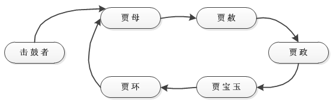
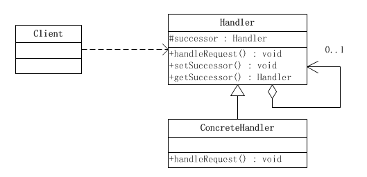
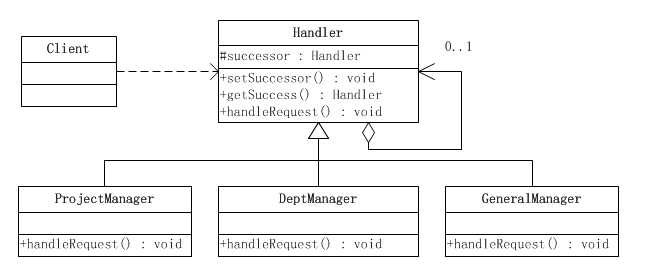

# 责任链模式

 > Create Time ： 2017年6月23日 Author : huduku.io Ref : http://www.cnblogs.com/java-my-life/archive/2012/05/28/2516865.html

 在阎宏博士的《JAVA与模式》一书中开头是这样描述责任链（Chain of Responsibility）模式的：

 > 责任链模式是一种对象的行为莫是。在责任链模式里，很多对象由每一个对象对其下家的引用而连接起来形成一条链，请求在这个链上传递，直到链上的某一个对象决定处理此请求。发出这个请求的客户端并不知道链上的哪一个对象最终处理这个请求，这使得系统可以在不影响客户端的情况下动态地重新组织和分配责任。

 ## 从击鼓传花谈起

 击鼓传花是一种热闹而又紧张的饮酒游戏。在酒宴上宾客依次坐定位置，由一人击鼓，击鼓的地方与传花的地方是分开的，以示公正。开始击鼓时，花束就开始依次传递，鼓声一落，如果花束在某人手中，则该人就得饮酒。

 比如说，贾母，贾赦，贾政，贾宝玉和贾环是五个参加击鼓传花游戏的传花者，他们组成一个环链。击鼓者将花传给贾母，开始传花游戏，花由贾母传给贾赦，由贾赦传给贾政，有贾政传给贾宝玉，又由贾宝玉传给贾环，由贾环传给贾母，如此往复，如下图所示。当击鼓声停止时，手中有花的人就得执行酒令。

 

 击鼓传花便是责任链模式的应用。责任链可能是一条直线，一个环链或者一个树形结构的一部分。

 ## 责任链模式的结构

 下面使用了一个责任链模式的最简单的实现。

 

 责任链模式涉及到的角色如下所示：

 * `抽象处理者（Handler）角色` - 定义一个处理请求的接口，如果需要，接口可以定义出一个方法以设定和返回对下家的引用。这个角色通常由一个Java抽象类或者Java接口实现，上图中的Handler类的聚合关系给出了具体子类对下家的引用，抽象方法handleRequest()规范了子类处理请求的操作。
* `具体处理者(ConcreteHandler)角色` - 具体处理者接到请求后，可以选择将请求处理掉，或者将请求传给下家。由于具体处理者持有对下家的引用，因此，如果需要具体处理者可以访问下家。

## 源代码

抽象处理者角色

```Java
public abstract class Handler {
    /**
     * 持有后继的责任对象
     **/
    private Handler successor;

    /**
     * 示意处理请求的方法，虽然这个示意方法是没有传入参数的
     * 但是实际上是可以传入参数的，根据具体需要来选择是否传递参数
     **/ 
    public abstract void handleRequest();

    /**
     * 取值方法
     */
    public Handler getSuccessor(){
        return successor;
    }

    /**
     * 赋值方法，设置后继的责任链对象
     **/
    public void setSuccessor(Handler successor) {
        this.successor = successor;
    }
}
```

具体处理者角色

```Java
public class ConcreteHandler extends Handler {
    /**
     * 处理方法，调用此方法处理请求
     **/
    @Override
    public void handleRequest () {
        System.out.println("处理请求");
        if (getSuccessor() != null) {
            System.out.println("传递请求给下家");
            getSuccessor().handleRequest();
        }else {
            System.out.println("如果没有下家，特殊处理");
        }
    }
}

```

客户端类

```Java
public class Client {
    public static void main(String[] args) {
        //组装责任链
        Handler handler1 = new ConcreteHandler();
        Handler handler2 = new ConcreteHandler();
        handler1.setSuccessor(handler2);
        //提交请求
        handler1.handleRequest();
    }
}
```

可以看出，客户端创建了两个处理者对象，并指定第一个处理者对象的下家是第二个处理者对象，而第二个处理者对象没有下家。然后客户端将请求传递给第一个处理者对象。

由于本示例的传递逻辑非常简单，只要有下家，就传给下家处理；如果没有下家，就自行处理。因此，第一个处理者对象接到请求后，会将请求传递给第二个处理者对象。由于第二个处理者对象没有下家，于是自行处理请求，活动时序图如下所示：


## 使用场景

来考虑这样一个功能申请聚餐费用的管理。

很多公司都是这样的福利，就是项目组或者是部门可以向公司申请一些聚餐费用。用于组织项目组成员或者是部门成员进行聚餐活动。

申请聚餐费用的大致流程一般是，由申请人先填写申请单，然后交给领导审批，如果审批下来，领导人会通知申请人审批通过，然后申请人去财务领取费用，如果没有批准下来，领导会通知申请人审批未通过，此事就此作罢。

不同级别的领导，对于审批的额度是不一样的，比如，项目经理只能审批500元以下的申请，部门经理能审批1000元以内的申请，而总经理可以审核任意额度的申请。

也就是说，当某人提出聚餐费用的申请后，该请求会经由项目经理，部门经理，总经理之中的某一位领导来进行相应的处理，但是提出申请的人并不知道最终会由谁来处理他的请求，一般申请人是把自己的申请提交给项目经理，或许最后是由总经理来处理他的请求。

可以使用责任链模式来实现上述功能：当某人提出聚餐费用申请的请求后，该请求会在项目经理->部门经理->总经理这样一条领导处理链上进行传递，发出请求的人并不知道谁会来处理他的请求，每个领导会根据自己的职责范围，来判断处理请求还是把请求提交给更高级别的领导，只要领导处理了，传递就结束了。

需要把每位领导的处理独立出来，实现成单独的职责处理对象，然后为他们提供一个公共的、抽象的父职责对象，这样就可以在客户端来动态地组合责任链，实现不同的功能要求了。



## 源代码

抽象处理者角色类

```Java
public abstract class Handler {
    private Handler successor;

    public Handler getSuccessor(){
        return successor;
    }

    public void setSuccessor(Handler successor) {
        this.successor = successor;
    }

    public abstract String handleFeeRequest(String user,double fee);
}
```

具体处理者角色

```Java
public class ProjectManager extends Handler {
    @Override
    public String handleFeeRequest (String user,double fee) {
        String str = "";
        
        if (fee < 500) {
            if ("张三".equals(user)) {
                str = "成功：项目经理同意【" + user + "】的聚餐费用，金额为" + fee + "元";    
            }else{
                //其他人一律不同意
                str = "失败：项目经理不同意【" + user + "】的聚餐费用，金额为" + fee + "元";
            }
        }else{
            //超过500 ， 继续传递给级别更高的人来处理
            if (null != getSuccessor()) {
                return getSuccessor().handleFeeRequest();
            }
        }
        return str;
    }
}
```

```Java
public class DeptManager extends Handler {
    @Override
    public String handleFeeRequest (String user,double fee) {
        String str = "";
        
        if (fee < 1000) {
            if ("张三".equals(user)) {
                str = "成功：项目经理同意【" + user + "】的聚餐费用，金额为" + fee + "元";    
            }else{
                //其他人一律不同意
                str = "失败：项目经理不同意【" + user + "】的聚餐费用，金额为" + fee + "元";
            }
        }else{
            //超过1000 ， 继续传递给级别更高的人来处理
            if (null != getSuccessor()) {
                return getSuccessor().handleFeeRequest();
            }
        }
        return str;
    }
}
```

```Java
public class GeneralManager extends Handler {
    @Override
    public String handleFeeRequest (String user,double fee) {
        String str = "";
        
        if (fee >= 1000) {
            if ("张三".equals(user)) {
                str = "成功：项目经理同意【" + user + "】的聚餐费用，金额为" + fee + "元";    
            }else{
                //其他人一律不同意
                str = "失败：项目经理不同意【" + user + "】的聚餐费用，金额为" + fee + "元";
            }
        }
        return str;
    }
}
```

```Java
public class Client {
    public static void main(String[] args) {
        Handler handler1 = new GeneralManager();
        Handler handler2 = new DeptManager();
        Handler handler3 = new ProjectManager();

        handler3.setSuccessor(handler2);
        handler2.setSuccessor(handler1);

        //开始测试
        String test1 = handler3.handleFeeRequest("张三", 300);
        System.out.println("test1 = " + test1);
        String test2 = handler3.handleFeeRequest("李四", 300);
        System.out.println("test2 = " + test2);
        System.out.println("---------------------------------------");
        
        String test3 = handler3.handleFeeRequest("张三", 700);
        System.out.println("test3 = " + test3);
        String test4 = handler3.handleFeeRequest("李四", 700);
        System.out.println("test4 = " + test4);
        System.out.println("---------------------------------------");
        
        String test5 = handler3.handleFeeRequest("张三", 1500);
        System.out.println("test5 = " + test5);
        String test6 = handler3.handleFeeRequest("李四", 1500);
        System.out.println("test6 = " + test6);
    }
}
```


## 纯与不纯的责任链模式

一个纯的责任链模式要求一个具体的处理者对象只能在两个行为中选择一个：一是承担责任，二是把责任推给下家。不允许出现某一个具体的处理者对象在承担了一部分职责后又把责任向下传的情况。

在一个纯的责任链模式里面，一个请求必须被有一个处理者对象所接收；在一个不纯的责任链模式里面，一个请求可以最终不被任何接收终端对象所接收。

纯的责任链模式的实际例子很难找到，一般看到的例子均是不纯的责任链模式的实现。有些人认为不纯的责任链模式根本不是责任链模式，这也许是有道理的但是在实际的系统里，纯的责任链很难找到。如果坚持责任链不纯便不是责任链模式，那么责任链模式便不会有太大意义了。

## 责任链模式在filter过滤器技术中的应用

//省略

