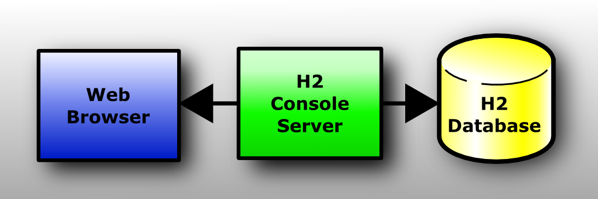

# H2内存数据库 - QuickStart

> Create Time : 2017年4月11日 Ref : http://www.h2database.com/html/quickstart.html

## Embedding H2 in an Application

This database can be used in embedded mode,or in server mode.To use it in embedded mode , you need to :
* Add the `h2*.jar` to the classpath (H2 does not have any dependencies)
* Use the JDBC driver class : `org.h2.Driver`
* The database URL `jdbc:/h2:~/test` opens the database test in your user home directory
* A new database is automatically created

## The h2 Console Application

The Console lets you accesses a SQL database useing a browser interface.

If you don't have Windows XP , or if something does not work as expected , please see the detailed description in the [Tutorial](./h2-tutorial.md).

### Step by Step

#### INstallation

Install the software using the Windows Installer (if you did not yet do that).

#### Start the Console

Click [Start],[All Programs] , [H2] , and [H2 Console (Command Line)]:

A new console window appears:

Also , a new browser page should open with the URL http://localhost:8082 . You may get a security warning from the firewall . If you don't want other computers in the network to access the database on your machine , you can let the firewall block these connections . Only local connections are required at ths time.

#### Login

Select [Generic H2] and click [Connect] :

You are now logged in.

#### Sample

Click on the [Sample SQL Script] :

The SQL commands appear in the command area.

#### Execute 

Click [Run] 

On the left side , a new entry TEST is added below the database icon . The operations and results of the statements are shown below the script.

#### Disconnect

Click on [Disconnect] :

to close the connection.

#### End

Close the console window . For more infomation , see the [Tutorial](./h2-tutorial.md).

