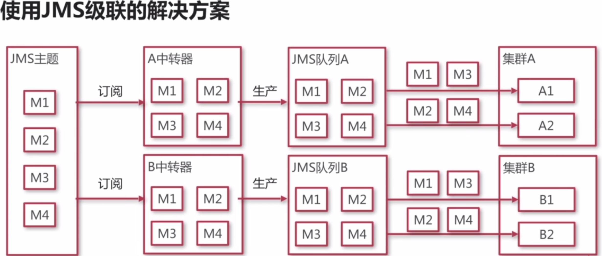
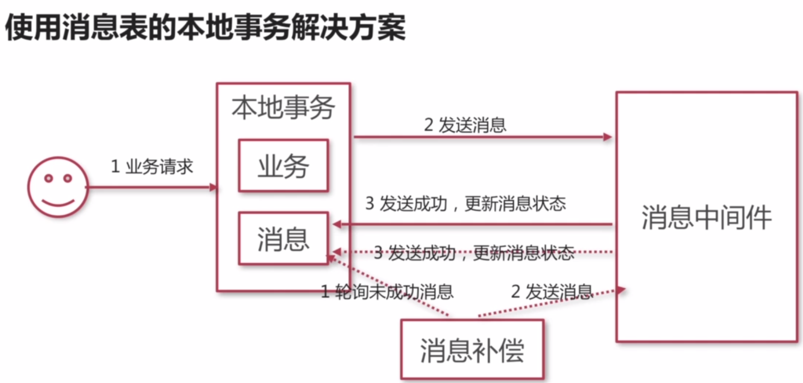
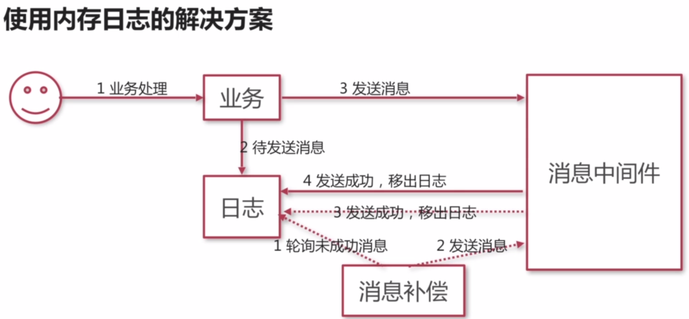
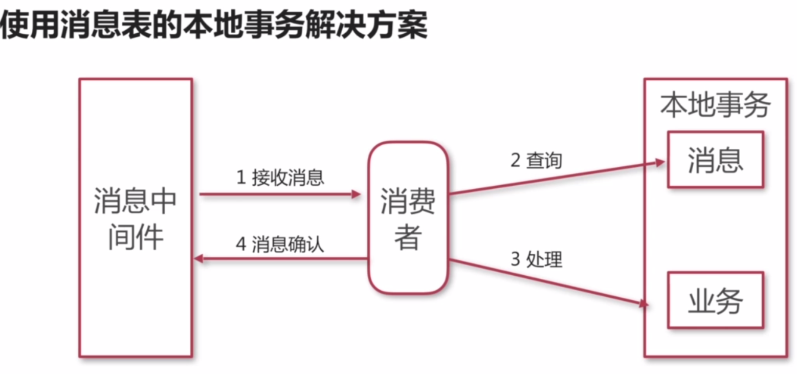
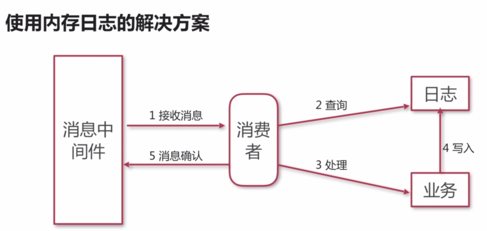
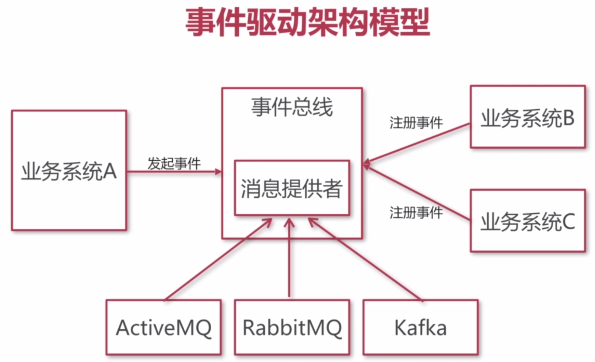

# 企业系统中的最佳实践

> Create Time : 2017年8月16日 Ref : http://www.imooc.com/video/15226  jovezhao

## 实际业务场景分析

登录系统

积分系统集群

日志系统集群

## 实际业务场景特点

1. 子业务系统都有集群的可能性
2. 同一个消息会广播给关注该类消息的所有子业务系统
3. 同一类消息在集群中被负载消费
4. 业务的发生和消息的发布最终一致性

## 需要解决的问题

1. 不同业务系统分别处理同一个消息，同一业务系统负载处理同类消息
2. 解决消息发送时的一致性问题
3. 解决消息处理的幂等性问题
4. 基于消息机制建立事件总线

## 集群系统处理消息方案

### 使用JMS级联

### 使用ActiveMQ的虚拟主题解决方案

1. 发布者 - 将消息发布到一个主题中，主题名以VirtualTopic开头，如VirtualTopic.TEST
2. 消费者 - 从队列中获取消息，在队列名中表明自己身份，如Consumer.A.VirtualTopic.TEST

## 解决消息发送时的一致性问题

### 使用JMS中XA系列接口保证强一致性

1. 引入分布式事务
2. 要求业务操作必须支持XA协议

### 使用消息表的本地事务解决方案

### 使用内存日志的解决方案

## 解决消息发送时的幂等性问题

### 使用消息表的本地事务解决方案

### 使用内存日志的解决方案

## 基于消息机制的事件总线

### 什么是事件驱动架构

事件驱动架构（Event Driven Architecture , EDA）定义了一个设计和实现一个应用系统的方法学，在这个系统里事件可传输于松散耦合的组件和服务之间。

* 特点 ： 有事我叫你，没事别烦我

### 事件驱动架构模型

