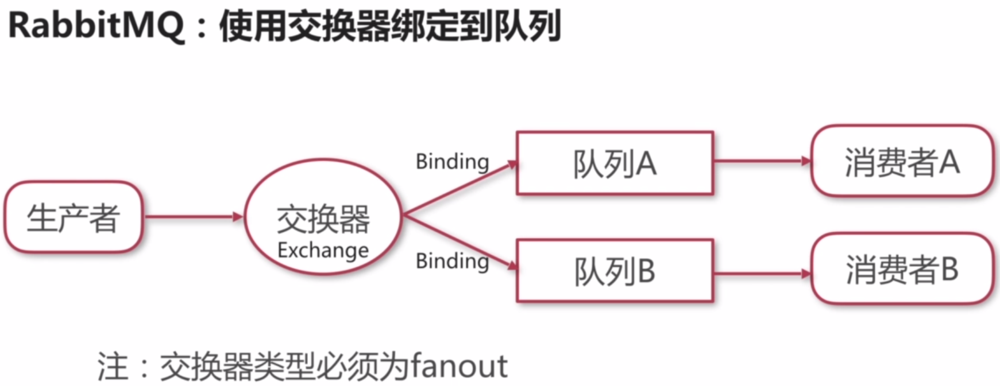

# 使用其他消息中间件 

> Create Time : 2017年8月16日 Ref : http://www.imooc.com/video/15227

## 企业开发需要解决的问题

1. 不同业务系统分别处理同一个消息，同一业务系统负载处理同类消息
2. 解决消息发送时的一致性问题
3. 解决消息处理的幂等性问题
4. 基于消息机制建立事件总线

## 分析要做的事

1. 解决个业务系统集群处理同一条消息
2. 实现自己的消息提供者

## 常用消息中间件

1. ActiveMQ
2. RabbitMQ
3. Kafka

## RabbitMQ： 使用交换器绑定的队列

1. 创建ConnectionFactory
2. 创建Connection
3. 创建Channel
4. 创建Exchange
5. 定义Queue并且绑定队列

## 集成Kafka

Kafka使用group.id分组消费者

1. 配置消费者参数group.id相同时对消息进行负载处理
2. 配置服务器partitions参数,控制同一个group.id下的consumer数量小于partitions
3. Kafka只保证同一个partition下的消息是有序的

Kafka消息提供者源码解析

1. 创建生产者
2. 创建消费者

## 源码获取

https://github.com/jovezhao/nest

# 课程总结

入门与拓展

