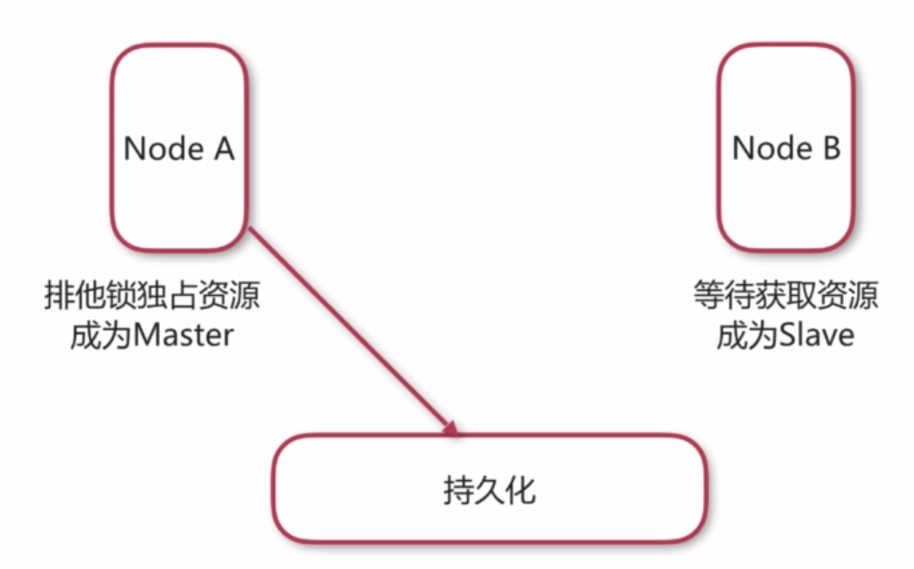
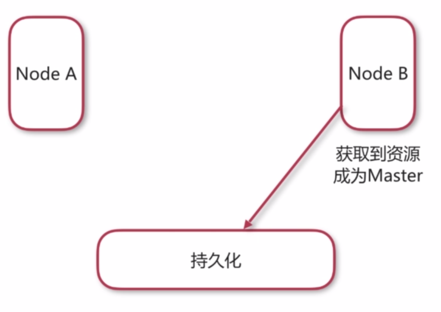
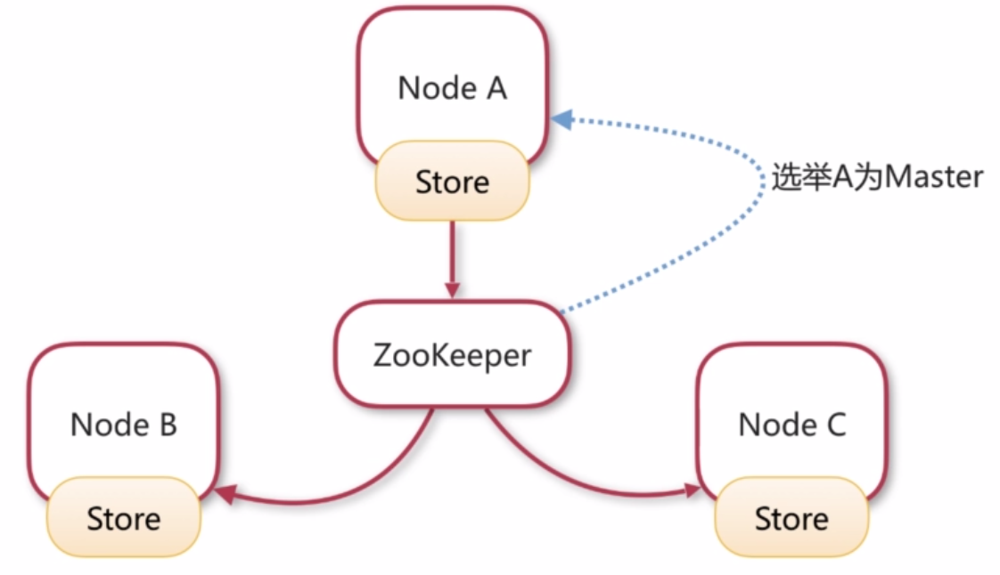
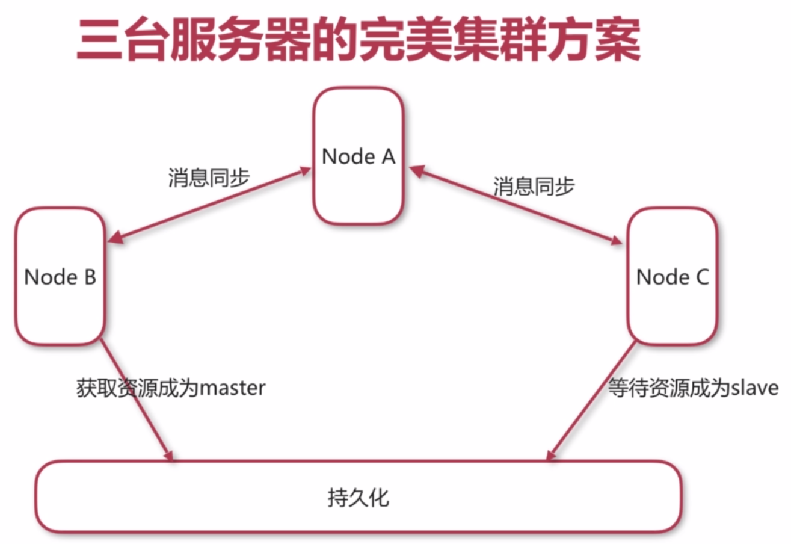

# ActiveMQ集群配置

> Create Time : 2017年8月16日 Ref : http://www.imooc.com/video/15223

## 为什么需要消息中间件集群

1. 实现高可用，以排除单点故障引起的服务中断
2. 实现负载均衡，以提升效率为更多客户提供服务

## 集群方式

1. 客户端集群： 让多个消费者消费同一个队列
2. Broker cluster： 多个Broker之间同步消息
3. Master Slave ： 实现高可用

## 客户端配置

ActiveMQ失效转移（failover）

允许当其中一台消息服务器宕机时，客户端在传输层上重新连接到其他消息服务器。

语法： failover:(uri1,...,uriN)?transportOptions

transportOptions参数说明

1. randomsize 默认为true，表示在URI列表中选择URI连接时是否采用随机策略。
2. initialReconnectDelay 默认为10，单位毫秒，表示第一次尝试重连之间的等待时间。
3. maxReconnectionDelay 默认30000，单位毫秒，最长重连时间间隔。

## 原理

节点A和节点B之间的消息可以互相同步。这样节点A接收到的消息可以被节点B的消费者消费，节点B接收到的消息可以被节点A的消费者消费。实现方式是网络连接器。

* NetworkConnector （网络连接器）

网络连接器主要用于配置ActiveMQ服务器之间的网络通讯方式，用于服务器透传消息。

网络连接器分为静态连接器和动态连接器两种。

1. 静态连接器

```xml
<networkConnectors>
    <networkConnector uri="static:(tcp://127.0.0.1:61617,tcp://127.0.0.1:61618)" />
</networkConnectors>
```

2. 动态连接器

```xml
<networkConnectors>
    <networkConnector uri="multicast://default" />
</networkConnectors>

<transportConnectors>
    <transportConnector uri="tcp://localhost:0" discoveryUri="multicast://default" />
</transportConnectors>
```


## ActiveMQ Master Slave 集群方案

1. Share nothing storage master/slave (已经过时，5.8+后移除)
2. Shared storage master/slave 共享存储。 节点获取到消息，储存排它锁，就可以成为Master，没有获取到资源锁的节点成为slaver
3. Replicated LevelDB Store基于复制的LevelDB Store （使用zk来选举master，不同节点间的数据使用zk来复制）

## 共享存储集群的原理

持久化: jdbc数据库， jsan文件配置。

```xml
<persistenceAdapter>
    <kahaDB directory="/path/to/kahaDB" />
</persistenceAdapter>
```

启动A，A获取到资源的排它锁，成为Master：



A挂掉，failover，节点B立即获取资源排它锁，成为Master




## 基于复制的LevelDB Store的原理

因为基于zk，服务器至少有三台。




## 两种集群方式对比

| | 高可用 | 负载均衡 |
| -- | -- | -- |
| Master/Slave | 是 | 否 |
| Broker Cluster | 否 | 是 |

## 三台服务器的完美集群方案



这个时候要立即恢复宕机的服务器。


