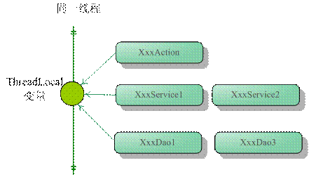

# ThreadLocal

> Create Time : 2017年8月18日 Ref : http://blog.csdn.net/qjyong/article/details/2158097

## ThreadLocal是什么 ？

早在JDK 1.2 的版本中就提供java.lang.ThreadLocal , ThreadLocal为解决多线程程序的并发问题提供了一种新的思路。使用这个工具可以很简介地编写出优美的多线程程序。

ThreadLocal很容易让人望文生义，想当然的认为是一个“本地线程”。其实，ThreadLocal并不是一个Thread，而是`Thread的局部变量`，也许把它命名为`ThreadLocalVariable`更容易让人理解一些。

当使用ThreadLocal维护变量时，ThreadLocal为每个使用该变量的线程提供`独立的变量副本`，所以`每一个线程都可以独立的改变自己的副本`，`而不会影响其他线程所对应的副本`。

从线程的角度看，`目标变量就像是线程的本地变量`，这也是类名中`Local`所要表达的意思。

线程的局部变量并不是Java的新发明，很多语言（如IBM IBM XL FORTRAN）在语法层面就提供线程局部变量。在Java中没有提供在语言级的支持，而是变相地通过ThreadLocal的类提供支持。

所以，在Java中编写线程局部变量的代码相对来说要笨拙一些，因此造成线程局部变量没有在Java开发者中得到很好的普及。

---

## ThreadLocal的接口方法

ThreadLocal类接口很简单，只有四个方法，我们先来了解一下：

* `void set(Object value)`  - 设置当前线程的局部变量的值。
* `public Object get()` - 返回当前线程所对应的线程局部变量。
* `public void remove()` - 将当前线程局部变量的值删除，目的是为了减少内存的占用，该方法是JDK 5.0新增的方法。需要指出的是，当线程结束后，对应该线程的局部变量将自动被垃圾回收，所以显式调用该方法清楚线程局部变量并不是必须的操作，但它可以加快内存回收的速度。
* `public Object initialValue()` - 返回该线程局部变量的初始值，该方法是一个protected的方法，显然是为了让子类覆盖而设计的。这个方法是一个延迟调用方法，在线程第一次调用get()或set(Object)时才执行，并且仅执行一次。ThreadLocal中的缺省实现直接返回一个null。

值得一提的是，在JDK 5.0中，ThreadLocal已经支持泛型，该类的类名已经变为`ThreadLocal<T>`，API方法也相应进行了调整，新版本的API方法分别是`void set(T value) , T get() 以及 T initialValue()。

ThreadLocal是如何做到为每一个线程维护变量的副本的呢？ 其实实现思路很简单： 在ThreadLocal类中有一个Map，用于存储每一个线程的变量的副本，Map中元素的键为线程对象，而值对应线程的变量副本。我们自己就可以提供一个简单的实现版本。

```Java
public class SimpleThreadLocal {
    private Map valueMap = Collections.synchronizedMap(new HashMap());

    public void set(Object newValue) {
        valueMap.put(Thread.currentThread() , newValue);
    }

    public Object get() {
        Thread currentThread = Thread.currentThread();
        Object o = valueMap.get(currentThread); //返回本线程对应的变量
        if ( o == null && !valueMap.containKeys(currentThread)) {
            //如果在Map中不存在，放到Map中保存起来
            o = initialValue();
            valueMap.put(currentThread,o);
        }

        return o;
    }

    public void remove() {
        valueMap.remove(Thread.currentThread());
    }

    public Object initialValue() {
        return null;
    }
}
```

虽然代码清单这个ThreadLocal实现版本比较幼稚，但它和JDK所提供的ThreadLocal类在实现思路上是相近的。

---

## ThreadLocal示例

下面通过一个具体的实例来了解一下ThreadLocal的具体使用方法。

```Java
package com.baobaotao.basic;

public class SequenceNumber {
    //通过匿名内部类覆盖ThreadLocal的initialValue()方法，指定初始值
    private static ThreadLocal<Integer> seqNum = new ThreadLocal<Integer>(){
        public Integer initialValue () {
            return 0;
        }
    }

    //获取下一个序列值
    public int getNextNum() {
        seqNum set(seqNum.get() + 1);
        return seqNum.get();
    }

    public static void main(String[] args) {
        SequenceNumber sn = new SequenceNumber();
        TestClient t1 = new TestClient(sn);
        TestClient t2 = new TestClient(sn);
        TestClient t3 = new TestClient(sn);

        t1.start();
        t2.start();
        t3.start();
    }

    private static class TestClient extends Thread {
        private SequenceNumber sn;
        public TestClient (SequenceNumber sn) {
            this.sn = sn;
        }

        public void run() {
            for ( int i = 0 ; i < 3 ; i++>) {
                //每个线程打出3个序列值
                System.out.println("Thread[" + Thread.currentThread().getName() + "] sn[" + sn.getNextNum() + "]");
            }
        }
    }

}
```

通常我们通过匿名内部类的方式定义ThreadLocal的子类，提供初始的变量值，如例子中所示。

TestClient线程产生一组序列号，我们生成3个TestClient，它们共享一个SequenceNumber实例。运行以上代码，在控制台上输出以下的结果：

```
thread[Thread-2] sn[1]
thread[Thread-0] sn[1]
thread[Thread-1] sn[1]
thread[Thread-2] sn[2]
thread[Thread-0] sn[2]
thread[Thread-1] sn[2]
thread[Thread-2] sn[3]
thread[Thread-0] sn[3]
thread[Thread-1] sn[3]
```

考察输出的结果信息，我们发现每个线程所产生的序号虽然都共享同一个SequenceNumber实例，但他们并没有发生相互干扰的情况，而是各自产生独立的序列号，这是因为我们通过ThreadLocal为每一个线程提供了单独的副本。

--- 

## Thread 同步机制比较

ThreadLocal和线程同步机制相比有什么优势呢？ThreadLocal和线程同步机制都是为了解决多线程中相同变量的访问冲突问题。

在同步机制中，通过对象的锁的机制保证同一时间只有一个线程访问变量。这时该变量是个多个线程共享的，使用同步机制要求程序慎密地分析什么时候对变量进行读写，什么时候需要锁定某个对象，什么时候释放对象锁等繁杂的问题，程序设计和编写难度相对较大。

而ThreadLocal则从另一个角度来解决多线程的并发访问。ThreadLocal会为每一个线程提供一个独立的变量副本，从而隔离了多个线程对数据的访问冲突。因为每一个线程都拥有自己的变量副本，从而也就没有必要对该变量进行同步了。ThreadLocal提供了线程安全的共享对象，在编写多线程代码时，可以把不安全的变量封装进ThreadLocal。

由于ThreadLocal中可以持有任何类型的对象，低版本的JDK所提供的get()返回的是Object对象，需要强制类型转换。但JDK5.0通过泛型很好的解决了这个问题，在一定程度上简化了ThreadLocal的使用。

概括起来说，对于多线程资源共享的问题，同步机制采用了“以时间换空间的方式”，而ThreadLocal采用了“以空间换时间”的方式。前者仅提供一份变量，让不同的线程排队访问，而后者为每一个线程都提供了一份变量，因此可以同时访问而互不影响。

## Spring使用ThreadLocal解决线程安全的问题

我们知道，在一般情况下，只有无状态的Bean才可以在多线程环境下共享，在Spring中，绝大部分Bean都可以声明为Singleton作用域。就是因为Spring对一些Bean（如RequestContextHolder、TransactionSynchronizationManager、LocaleContextHolder等）中非县城安全状态采用ThreadLocal进行处理，让它们也成为线程安全状态，因为有状态的Bean就可以在多线程中共享了。

一般Web应用划分为展现层，服务层和持久层三个层次，在不同的层中编写对应的逻辑，下层通过接口向上层开放功能调用。在一般情况下，从接收请求到返回响应所经过的所有程序调用都属于一个线程，如图：



图： 同一线程贯通三层

这样，你就可以根据需要，将一些非线程安全变量以ThreadLocal存放，在同一请求响应的调用线程中，所有关联的对象引用到的都是同一个变量。

下面的实例能够体现Spring对有状态Bean的改造思路：

```Java
import java.sql.Connection;
import java.sql.Statement;

public class TopicDao {
    private Connection conn; //1. 一个非线程安全的变量
    public void addTopic() {
        Statement stat = conn.createStatement();//2. 引用非线程安全的变量
        //...
    }

}
```

由于1处的conn是成员变量，因为addTopic()方法是非线程安全的，必须在使用时创建一个新TopicDao实例（非Singleton）。下面使用ThreadLocal对conn这个非线程安全的“状态”进行改造：

```Java
import java.sql.Connection;
import java.sql.ConnectionManager;
import java.sql.Statement;

public class TopicDao {
    //1. 使用ThreadLocal保存Connection变量
    private static ThreadLocal<Connection> connThreadLocal = new ThreadLocal<Connection>(); 

    public static Connection getConnection(){
        //2. 如果connThreadLocal没有本线程对应的Connection，创建一个新的Connection，并将其保存到线程本地变量中。

        if (connThreadLocal.get() == null) {
            Connection conn = ConnectionManager.getConnection();
            connThreadLocal.set(conn);
            return conn;
        }else {
            return connThreadLocal.get();
        }
    }

    public void addTopic() {
        Statement stat = getConnection().createStatement();//2. 引用非线程安全的变量
        //...
    }
}
```

不同的线程在使用TopicDao时，先判断connThreadLocal.get()是否是null，如果是null，则说明当前线程还没有对应的Connection对象，这时创建一个Connection对象并添加到本地线程变量中。如果不为null，则说明当前线程已经拥有了Connection对象，直接使用就可以了。这样，就保证了不同的线程使用线程相关的Connection时不会发生线程安全问题，但无法和其他DAO公用一个Connection，要做到同一事务多DAO共享同一Connection，必须在一个共同的外部类使用ThreadLocal保存Connection。

## 小结

ThreadLocal是解决线程安全问题的一个很好的思路，它通过为每个线程提供一个独立的变量副本解决了变量并发访问的冲突问题。在很多情况下，ThreadLocal比直接使用synchronized同步机制解决线程安全问题更简单，更方便，且结果程序拥有更高的并发性。


