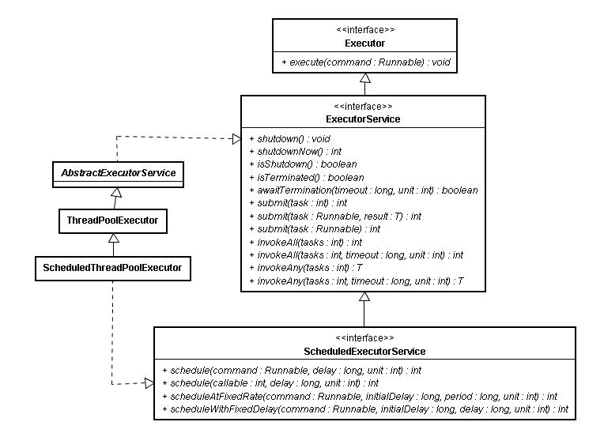

# 细说Executor框架线程池任务执行全过程

> Create Time : 2017年2月19日  Ref ： http://www.infoq.com/cn/articles/executor-framework-thread-pool-task-execution-part-01/

## 前言

JDK5之后引入的Executor框架的最大有点是把任务的提交和执行解耦。要执行的人只需要 把Task描述清楚，然后提交即可。这个Task是怎么被执行的，被谁执行的，什么时候执行，提交的人就不用关心了。具体点讲，提交一个`Callable`对象给`ExecutorService`（如最常用的线程池`ThreadPoolExecutor`）,将得到一个`Future`对象，调用`Future`对象的`get`方法等待执行结果好了。

经过这样的封装，对于使用者老说，提交任务获取结果的过程大大讲话，调用者直接从提交的地方就可以等待获取执行结果。而封装最大的效果是使得真正执行任务的线程们变得不为人知。有没有觉得这个场景似曾相似？我们工作中当老大的老大（且称作LD^2）把一个任务交给我们老大（LD）的时候，到底是LD自己干，还是转过身来拉一帮苦逼的兄弟加班加点干，那LD^2是不管的。LD^2只用把人描述清楚提及给LD，然后喝着咖啡等着收LD的report即可。等LD一封邮件非常优雅的报告LD^2 report结果时，实际操作中是码农A和码农B干了一个月，还是码农ABCDE加班干了一个礼拜，大多是不用体现的。这套机制的优点就是LD^2找个合适的LD来提交任务即可，接口友好有效，不用为具体怎么干费神费力。

## 一个最简单的例子

看上去这个执行过程是这个样子，调用这段代码的是老大的老大了，他所需要干的所有事情就是找到一个合适的老大（如下面例子中的laodaA就荣幸的被选中了），提交任务就好了。

```Java
//一个有7个作业线程的线程池，老大的老大找到一个管7个人的小团队的老大
ExecutorService laodaA = Executors.newFixedThreadPool(7);
//提交作业给老大，作业内容封装在Callable中，约定好了输出类型是String
String outputs = laoda.submit(
    new Callable<String>(){
        public String call() throws Exception {
            return "I'm a task , which submited by the so called laoda , and run by those anonymous workers";
        }
        //提交后就等着结果吧，到底是手下7个作业中谁领到任务了，老大是不关心的。
    }
).get();
System.out.println(outputs);
```

使用上非常简单，其实只有两行语句来完成所有功能；创建一个线程池，提交任务并等待获取执行结果。

例子中，生成线程池采用了工具类`Executors`的静态方法，除了`newFixedThreadPool`可以生成固定大小的线程池，`newCachedThreadPool`可以生成一个无界、可以自动回收的线程池；`newSingleThreadScheduledExecutor`可以生成一个单个线程的线程池；`newScheduledThreadPool`还可以生成支持周期任务的线程池。 一般用户场景下各种不同设置要求的线程池可以这样生成，不用自己new一个线程池出来。

## 代码剖析

这套机制怎么用，上面两句语句就做到了，非常方便和友好。但是`submit`的`task`是怎么被执行的？是谁执行的？如何做到在调用的时候只有等待执行结束才能`get`到结果。这些都是JDK5之后`Executor`接口下的线程池、`Future`接口下的可获得执行结果的任务，配合AQS和原有的`Runnable`来做到的。在下文中我们尝试通过剖析每部分源代码来了解`Task`提交，`Task`执行，获取`Task`执行结果的主要步骤。为了控制篇幅，突出主要逻辑，文章中是以最常用的`ThreadPoolExecutor`线程池来举例。其实`ExecutorService`接口下定义了很多功能丰富的其他类型，有各自的特点，但风格类似。本文重点是介绍任务提交的过程，过程中设计的`ExecutorService`、`ThreadPoolExecutor`、`AQS`、`Future`、`FutureTask`等只会介绍该过程中用到的内容，不会对每个类都详细展开。

### 任务提交

从类图上可以看到，接口`ExecutorService`继承自`Executor`，不像`Executor`中只定义了一个方法来执行任务，在`ExecutorService`中，正如其名字暗示的一样，定义了一个服务，定义了完整的线程池的行为，可以接受提交任务、执行任务、关闭服务。抽象类`AbstractExecutorService`类实现了`ExecutorService`接口，也实现了接口定义的默认行为。




