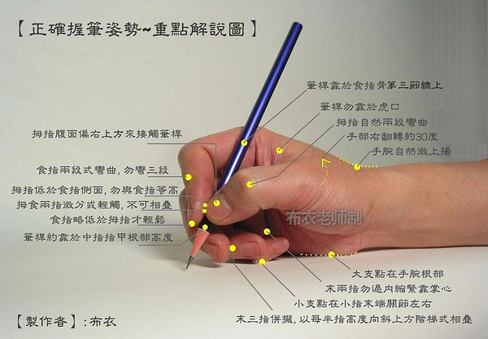

# 书法
> Create Time : 2017年3月10日

## 永字八法

> 作者 ： 佚名

* `点为侧` - 侧不等平其笔，当侧笔就右为之。
* `横为勒` - 勒不得卧其笔，中高下两头，以笔心压之。
* `竖为弩` - 弩不宜直其笔，直则无力，立笔左偃而下，最要有力。
* `钩为趯` - 趯须蹲锋得势而出，出则暗收。
* `提为策` - 左为上策，须斫笔背发而仰收，则背斫仰策和，两头高，中以笔心举之。
* `撇为掠` - 左下为掠，掠者拂掠须迅，其锋左而欲利。
* `短撇为啄` - 啄者，如禽之啄物也，其笔不罨，以疾为胜。
* `捺为磔` - 右下为磔，磔者，不徐不疾，战行顾卷，复驻而去之。

## 书法九势

> 作者 ： 蔡邕

夫书肇于自然，自然既立，阴阳生焉。阴阳既生，形势出矣。藏头护尾，力在字中，下笔用力，肌肤之丽。故曰：势来不可止，势去不可遏，惟笔软则奇怪生焉！

凡落笔结字，上皆覆下，下以承上，使其形势递相映带，无使势背。

* `转笔` - 宜左右回顾，无使节目孤露。
* `藏锋` - 点画出入之迹，欲左先右，至回左亦尔。
* `藏头` - 圆笔属纸，令笔心常在点画中行。
* `护尾` - 画点势尽，力收之。
* `疾势` - 出于啄磔之中，又在竖笔紧趯之内。
* `掠笔` - 在于趱锋峻趯用之。
* `涩势` - 在于紧駃战行之法。
* `横鳞` - 竖勒之规。

此名九势，得之虽无师授，亦能妙合古人，须翰墨功多，即造妙境耳。

## 硬笔握笔姿势图解

> 作者 ： 布衣

## 硬笔的运笔与发力

> 作者 ： huduku.io

使用腕部发力运笔，并带动握笔姿势中与笔杆相接触的四个点，即`拇指肚`、`食指尾`、`食指肚`、`中指第一指关节`。

其中：`中指第一指关节`只起到`固定笔杆`的作用，其他三个则会在手腕发力时待用笔杆运转，写出笔画。

最终的结果是中指始终不受力，而不正确的运笔发力方式则往往会导致中指非常疼痛。

四种基本笔画的注意事项：

* `横` - 发力点：`拇指肚、食指尾`。不要使笔杆压迫中指第一指关节。
* `竖` - 发力点：`食指肚`。不要使笔杆摩擦中指第一指关节。
* `撇` - 发力点：`食指肚`。不要使笔杆摩擦中指第一指关节。
* `捺` - 发力点：`拇指肚、食指尾、食指肚`。不要使笔杆压迫中指第一指关节。

> 其他笔画均可由四种基本笔画变化、衍生或组合得出。

什么时候可以算作掌握运笔、发力的技巧呢？

答： 不要让中指第一指关节感到疼痛。

