# 一份其实很短的LaTeX入门文档

> Create Time : 2018年6月1日20:20:35 Ref : https://liam0205.me/2014/09/08/latex-introduction/

> 转载中，省略了一部分不必要的内容。

## 优雅的LaTeX

有很多Geeks或者LaTeX's Fanatical Fans 过分强调了LaTeX的一些并非重点的特性，以至于很多初学者会觉得LaTeX很神秘，很复杂，从而引发了初学者的畏难情绪甚至负面情绪。尽管这些Fans说得并没有错，我是说在事实上，但是他们的表达方式和内心态度却间接阻碍了LaTeX的发展，我想这也是和他们的初衷相悖的。

我曾经也受到这些言论的影响，但幸运的是，至今为止，我已经跨过了这些障碍，并且更加坚信了他们所言的LaTeX的优点的正确性。因此我想以我自己的方式，向更多的人介绍LaTeX -- **这个优雅,但有着自己高傲，却绝不复杂甚至神秘的东西**;

## 你将从这里看到

1. 最简洁的(La)Tex编辑器--TeXworks--的基本使用方法。
2. 如何使用(Xe)LaTeX进行简单的中英混排。
3. 简单的文章组织结构。
4. 如何使用(Xe)LaTeX进行数学公式的排版。
5. 如何在(Xe)LaTeX的文档中插入图片/表格。
6. 如何进行简单的版面设置。
7. 几个最常见的带有TeX的单词的含义。
8. 出现问题应当如何处理/怎样聪明地提出你的问题--怎样从这里毕业。


## 你不会从这里看到

1. 如何安装TeX发行。
2. 特殊需求（特殊宏包）的解决办法。
3. 关于若干TeX发行的好坏比较。
4. 关于各种TeX编辑器好坏的比较。
5. 过多的废话。

## 你应当如何阅读本文

事实上，本文在行文过程中，会有相当多的提示帮助你以正确的方式阅读。因此，有必要再次先介绍以下最常用的一些标记。

1. *斜体* ： 使用*斜体*意味着如果忽略掉这些文字，你可能在逻辑上很淡理解后面某处的知识。
2. **粗体** ： 如果忽略掉这些文字，你可能在TeX的概念上很难理解后面某处的知识。
3. ***粗斜体*** : 这些文字是最重要的部分，是上述两种情况的合并。
4. 引用 ： 使用引用，表明这些文字在你第一次阅读本文的时候不需要了解，其中的内容可能过于深奥，或者过于琐碎。对于第一次接触TeX的你（如果你是TeX资深使用这，当然不在此列），如果了解到这些内容，可能会使你困惑，并且不会从实际上增加你对TeX的领悟以及对TeX的好感。

## 关于编辑器的简单介绍

流行的*TeX*发行，比如CTeX和TexLive，都自带有一些用于编辑文档的编辑器。这些编辑器的差异还是很大的，从简单的TeXworks到复杂的WinEdt，各种各样。但是不管是什么样的编辑器，他们都是用来编辑纯文本的而已(.tex纯文本)，换言之他们只是Windows自带的记事本程序的加强版而已，***他们本身并不是TeX系统的一部分***。

> 所谓TeX发行，也叫TeX发行版、Tex系统或者TeX套装，指的是包括TeX系统的各种可执行程序，以及他们执行时，需要的一些辅助程序和宏包文档的集合。

国内同学安装CTeX的比较多，CTeX套装自带了编辑器，除了大家熟知的WinEdt，还有TeXworks。而TexLive则只是自带了TeXworks。

本文只介绍了TeXworks编辑器的使用。原因有以下几点：

* WinEdt过于繁琐，很多功能用不上，反而给新手增加学习成本。
* TeXworks是TeXLive自带的编辑器，而TeXLive是跨平台的，哥哥操作系统都可以使用。
* 不管使用TeXLive还是CTeX套装又或是MiKTeX（Windows平台上另一个TeX系统），都有TeXworks。

## 启动TeXworks

启动TeXworks很简单，不论你安装的是CTeX套装还是TeXLive，你都可以在Windows启动对话框中输入texworks按回车，具体步骤是：

* `Windows + R` 
* 输入 : texworks
* 回车

如果这样打不开，你可能需要从开始菜单找到TeXworks图标以启动，或者进入TeX系统的安装目录找到TeXworks。

启动之后，TeXworks的界面，会默认占据你屏幕的左半边，而右半边留空。效果图如下：

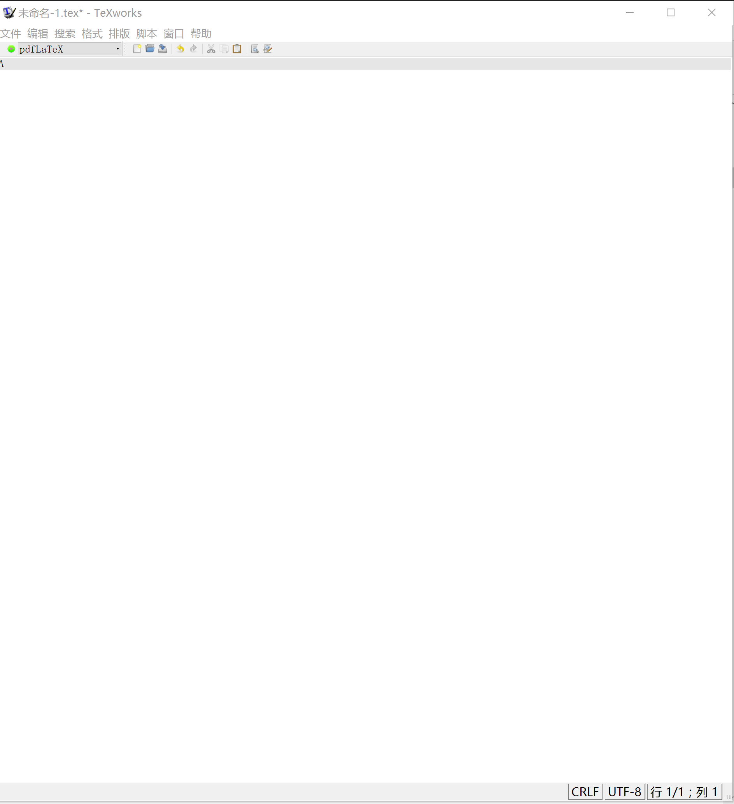

图中空白的部分，就是输入编辑文本的编辑框；在编辑框的右下角，显示有三个按钮，最左边的是换行符模式，中间的是*编码模式*，右边标示当前光标的所在位置；编辑框的上方是工具栏，工具栏的右半部份是大家熟悉的功能（新建，打开，保存，撤销，恢复，剪切，复制，粘贴，查找，替换），工具栏的左边则是*编译按钮(TeXworks也称其为【排版工具】)*；工具栏再往上，则是菜单蓝，此处按下不表。

> Windows，Unix等操作系统对待【换行符】是有所不同的。索性TeXworks为我们做了足够的提示，方便我们的选择（点击以下那个按钮就知道了）。一般而言，保持默认即可。
> 字符（包括英文字符和中文字符）在计算机中，经过编码以二进制的形式存储在计算机中。如果编辑器编码和计算机内部编码不一致，则会导致所谓【乱码】的现象。TeXworks默认使用UTF8编码，在我们的文档中不需要进行任何更改，而对于一些其他的文档可能需要按照要求更改编码。

## 排版工具

TeXWorks为我们预设了若干排版工具（pdfTeX，pdfLaTeX，XeTeX，XeLaTex等），他们分别代表什么实在太过负责，并且也不是当前需要讲明白的。本文中需要用到的排版工具主要是**XeLaTeX**，关于这些工具的介绍，可以参看后文。当你对TeX系统相当熟悉之后，也可以不适用TeXworks预设的工具，自己配置排版工具。

TeXworks默认的排版工具是pdfLaTeX，如果你希望更改这个默认值，可以在*编辑-首选项-排版-处理工具-默认*中修改。

在编辑框中，输入以下内容：

```tex
\documentclass{article}
%这里是导言区
\begin{document}
Hello,World!
\end{document}
```

将文档保存在你希望的位置，然后在排版工具的下拉狂中选中**XeKLaTex**后，按下绿色的编译按钮。一会儿，如果没有意外，屏幕的右边就会出现编译之后的结果。如下图:

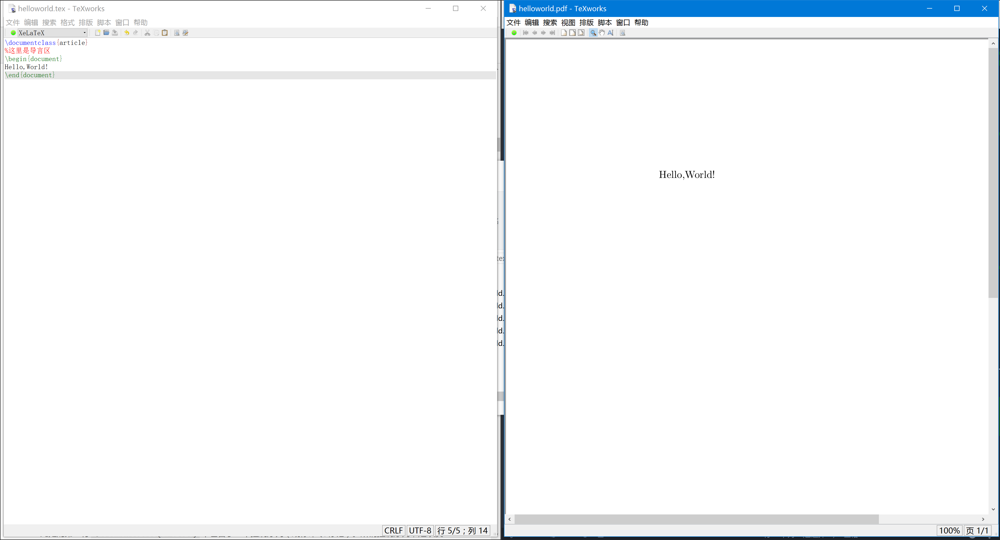

> 请注意，在Windows平台上，TeX涉及到的文件（包括.tex , .jpg等各类文件），最好都不要包含中文名字，或者包含空格。否则，可能引起意想不到的问题。

很容易发现，输入进编辑框的五行文字，在最终输出pdf文档中，只显示了一行。事实上，交付TeX处理的文档内容，并不会全部输出。

此处的第一行`\documentclass{article}`中包含了一个控制序列（或称命令/标记）。

```
所谓控制序列，是以反斜杠 \ 开头，以第一个 空格或非字母 的字符结束的一串文字。他们并不被输出，但是他们会影响输出文档的效果。
```

这里的控制序列是`documentclass`，它后面紧跟着的`{article}`代表这个控制序列有一个必要的参数，该参数的值为`article`。这个控制序列的作用是调用名为`article`的文档类。

***请注意 ： TeX对控制序列的大小写是敏感的***

> 部分控制序列还有被方括号`[]`包括的可选参数。
> 所谓文档类，即是Tex系统预设的（或是用户自定义的）一些格式的集合。不同的文档类在输出效果上会有差别。

此处第二行以`%`开头。在TeX风格的文档中，从`%`开始，到该行末尾的所有字符，都会被TeX系统无视，只作为工人阅读的注释。除非在`%`前加上反斜杠来取消这一特性。例如:

```
今年的净利率为20\%，比去年高。
```

此处的`%`被当作正常的百分号处理，后面的文字也将正常被输出。

其后，出现了控制序列`\begin`，这个控制序列总是与`\end`成对出现。这两个控制序列以及他们中间的内容被称为***环境***,他们之后的第一个必要参数总是***一致的***，被称为环境名。

只有在`document`环境中的内容，才会被正常输出到文档中去，或是作为控制序列对文档产生影响。也就是说，在`\end{document}`之后插入任何内容都是无效的。

`\begin{document}`与`\documentclass{article}`之间的部分倍场做导言区。导言区中的控制序列，通常会影响到整个输出文档。

> 比如，我们通常在导言去设置页面大小、页眉页脚样式、章节标题样式等等。

## 实现中英文混排

> 关于LaTeX的中文支持，首先要说的是，在现在，一切教你使用`CJK`宏包的模板、人、网页、书，都是糟糕的。

除掉成功生成第一个文档，实现中文输出(或者说是中英文混排)恐怕是困扰中国的TeX使用者的第二个普遍问题。众所周知，TeX系统是高教授开发的，当初并没有考虑到亚洲文字的问题。因此，早期的TeX系统并不能直接支持中文，必须要用其他工具先处理以下（或者是一些宏包之类的）。

但是现在，XeTeX原生支持Unicode，并且可以方便地调用系统字体。可以说解决了困扰中国TeX使用者多年的大问题。至此，我们只需要使用几个简单的红包，就能完成中文支持了。所谓宏包，就是一系列控制序列的合集。这写控制序列太常用，以至于人们会觉得每次将它们写在导言区太繁琐，于是将它们打包放在同一个文件中，成为所谓的宏包（台湾方面称之为【巨集套件】）。`\usepackage{·}`可以用来调用宏包。

除去中文支持，中文的版式处理和标点也是不小的挑战。好在由吴凌云和江疆牵头，现在主要由刘海洋、李清和我维护的`CTeX`宏集一次性解决了这些问题。`CTeX`宏集的优势在于，它适用于多种编译方式；在内部处理好了中文和中文版式的支持，隐藏了这些细节。并且，提供了不少中文用户需要的功能接口。我们来看如何使用`CTeX`宏集来处理中英文混排的文档。


> 请注意，`CTeX`宏集和`CTeX`套装是两个不同的东西。`CTeX`宏集本质是LaTex宏的集合，包含若干文档类（`.cls`文件）和宏包（`.sty`文件）。`CTeX`套装是一个TeX系统。

> 新版`CTeX`宏集的默认能够自动检测用户的操作系统，并为之配置合适的字库。对于Windows用户，Mac OS X用户和Linux用户，都无需做任何配置，就能使用`CTeX`宏集来排版中文。[2015-05-20 更新]

在TeXworks编辑框中输入以下内容，**以UTF-8编码保存，使用XeLaTeX编译：**

```tex
\documentclass[UTF8]{ctexart}
\begin{document}
你好，world!
\end{document}
```

如果没有意外，你将会看到类似下图的输出结果。

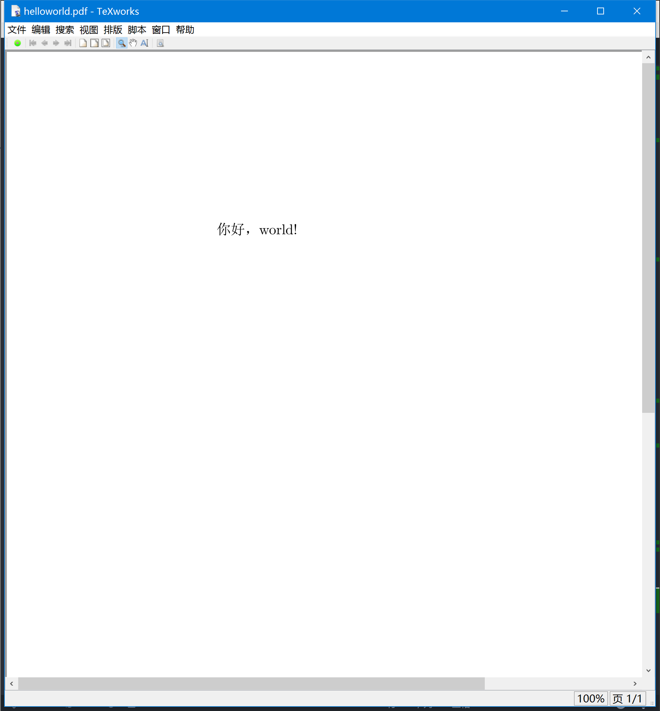

相教于之前的例子，这份代码只有细微的差异：

1. 文档类从`article`变为`ctexart`。
2. 增加了文档类选项`UTF-8`。

> 你也可以直接使用`xeCJK`宏包来支持中英文混排。不过大多数情况是不推荐这样做的。因此，如果你能抑制住你小小的好奇心，可以暂存略过这一段，回头再看保持。`:)`

> 在TeXworks编辑框中输入以下内容，保存，使用XeLaTeX编译：

```tex
\documentclass{article}
\usepackage{xeCJK} %调用xeCJK宏包
\setCJKmainfont{SimSun} %设置 CJK 主字体为SimSun (宋体) 
\begin{document}
你好，world!
\end{document}
```

如果一切顺利，你将会在屏幕右边的窗口，看见类似下图的输出结果。


除了`document`环境中同时出现了中文和英文，和最原始的Hello，world！不同点在于，导言区中多出了两条控制序列。他们的作用我已经用注释标出了。

`\setCJKmainfont{·}`是定义在"xeCJK"宏包中的控制序列，它可以用来设置CJK主字体。

如果你的TeX系统提示找不到字体，请按照以下提示操作。

Mac OS X用户请参照[这篇博客](https://liam0205.me/2014/11/02/latex-mactex-chinese-support/)中的方法，使用系统自带的字体册程序来查看系统字体。

非Mac OS X用户请按照如下步骤打开命令行（"nix系统请打开终端"）：

* `Windows + R`
* 输入`cmd`，回车

在系统命令行中输入如下命令：

```cmd
fc-list :lang=zh-cn > C:\font_zh-cn.txt
```


（相信使用"nix"的你，一定知道如何修改上述命令达到你想要的效果）

打开C盘根目录下的`C:\font_zh-cn.txt`纯文本文档，里面的内容就是你当前系统可用的全部中文字体。

形如：

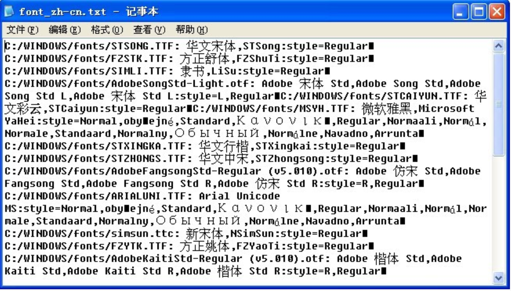


每一个小黑框之间的内容，就对应着一个可用的字体，这些小黑框实际上是换行符，但是由于Windows系统的原因，他们没有正常显示。如果看着不爽，你可以尝试用TeXworks打开这个文件查看（放心，能够打开的）。以下是我用 gVim 打开的效果：

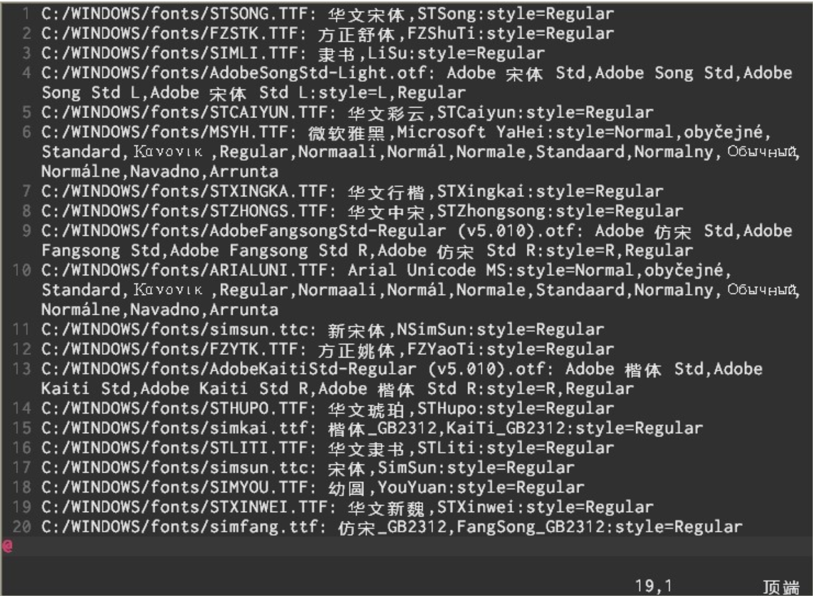

其中每一行，都代表这一个可用的字体。其形式如下：

```
<字体文件路径>: <字体标示名1>,<字体标示名2>:style=<字体类型>
```

我们可以看到途中的倒数第四行

```
C:/WINDOWS/fonts/simsun.ttx: 宋体,SimSun:style=Regular
```

出现了之前文档里调用的字体`SimSun`，此处表明该字体有两个表示名： `宋体,SimSun`，我们在`setCJKmainfont{·}`中填入任意一个都有同样的效果。


因此，如果之前的文档无法编译通过，请在你的操作系统字体中，选取一个自己喜欢的，将他的字体表示名填入到`\setCJKmainfont{·}`中去。

## 组织你的文章

由于新的中英混排方法的引入，这里对于每一个效果提供两份代码（如果有必要）。如果没有特别的要求，应当使用新方法。

## 作者、标题、日期

保存并用XeLaTeX编译如下文档，查看效果：

```tex
\documentclass[UTF8]{ctexart}
\title{你好，world!}
\author{Liam}
\date{\today}
\begin{document}
\maketitle
你好，world！ hello！
\end{document}
```

导言区复杂了很多，但和之前的文档主要的区别只有一处：定义了标题、作者、日期。

在`document`环境中，除了原本的`你好，world！ hello！`，还多了一个控制序列，`maketitle`。这个控制序列能将在导言区中定义的标题、作者、日期按照预定的格式展现出来。

> 使用`titling`宏包可以修改上述默认格式。参考[Texdoc](http://texdoc.net/texmf-dist/doc/latex/titling/titling.pdf)。

## 章节和段落

保存并用XeLaTeX编译如下文档，查看效果：

```tex
\documentclass[UTF8]{ctexart}
\title{你好，world!}
\author{Liam}
\date{\today}
\begin{document}
\maketitle
\section{你好中国}
中国在East Asia.
\subsection{Hello Beijing}
北京是capital of China.
\subsubsection{Hello Dongcheng District}
\paragraph{Tian'anmen Square}
is in the center of Beijing
\subparagraph{Chairman Mao}
is in the center of 天安门广场。
\subsection{Hello 山东}
\paragraph{山东大学} is one of the best university in 山东。
\end{document}
```

在文档类`article/ctexart`中，定义了五个控制序列来调整行文组织结构。他们分别是：

* `\section{·}`
* `subsection{·}`
* `subsubsection{·}`
* `\paragraph{·}`
* `subparagraph{·}`

> 在`report/ctexrep`中，还有`\chapter{·}`，在文档类`book/ctexbook`中，还定义了`\part{·}`。

## 插入目录

在上一节文档中，找到`\maketitle`，在它的下面插入控制序列`\tableofcontents`，保存并用XeLaTex**编译两次**，观察效果

```tex
\documentclass[UTF8]{ctexart}
\title{你好，world!}
\author{Liam}
\date{\today}
\begin{document}
\maketitle
\tableofcontents
\section{你好中国}
中国在East Asia.
\subsection{Hello Beijing}
北京是capital of China.
\subsubsection{Hello Dongcheng District}
\paragraph{Tian'anmen Square}
is in the center of Beijing
\subparagraph{Chairman Mao}
is in the center of 天安门广场。
\subsection{Hello 山东}
\paragraph{山东大学} is one of the best university in 山东。
\end{document}
```

> 试试交换`\maketitle`和`\tableofcontents`的顺序，看看会发生什么，想想问什么。

请注意，在【你好中国】这一节中，两次【中国在East Asia】中夹有一个空行，但输出却只有一个换行并没有空行。这是因为LaTeX将一个换行当作是一个简单的空格来处理，如果需要换行另起一段，则需要用两个换行（一个空行）来实现。

## 插入数学公式

首先恭喜你看到这里，如果前面几个文档你都认真编译过了，那么你已经可以圣人许多文档的排版工作。下面我们进入LaTeX最为犀利的部分。

这部分演示中，为了节省篇幅，将取消导言区中中文支持的部分。在实际使用中，你只需要将导言区部分加上，就可以同时使用中文并编写数学公式了--这并不冲突。

为了使用AMS-LaTeX提供的数学功能，我们需要在导言区加载`amsmath`宏包：

```tex
\usepackage{amsmath}
```

## 数学模式

LaTex的数学模式有两种，行内模式(inline)和行间模式(display)。前者在正文的行文中，插入数学公式，后者则独立排列，单独成行，并自动居中。

在行文中，使用`$ .....  $`可以插入行内公式，使用`\[ ....\]`可以插入行间公式，如果需要对行间公式进行编号，则可以使用`equation`环境：

```tex
\begin{equation}

....

\end{equation}
```

> 行内公式也可以使用`\(...\)`或者`\begin{math}.... \end{math}`来插入，但略显麻烦。
> 无编号的行间公式也可以使用`\begin{displaymath} ... \end{displaymath}`或者`\begin{equation*} ... \end{equation*}`来插入，但略显麻烦。(`equation*`中的`*`表示环境不编号)
> 也有plainTeX风格的`$$...$$`来插入不编号的行间公式。但是在LaTeX中这样做会改变行文的默认行间距，不推荐。请参考[我的回答](https://www.zhihu.com/question/27589739/answer/37237684)

## 上下标

示例代码（请保存后，使用XeLaTeX编译，查看效果）

```tex
\documentclass{article}
\usepackage{amsmath}
\begin{document}
Einstein 's  $E=mc^2$.

\[ E=mc^2 \]
\begin{equation}
E=mc^2
\end{equation} 
\end{document}
```

在这里提一下关于公式标点使用的规范。行内公式和行间公式对标点的要求是不同的：
行内公式的标点，应该放在数据模式的限定符之外，而行间公式则应该放在数据模式限定符之内。

在数学模式中，需要表示，可以使用`^`来实现(下标则是`_`)。**它默认只作用于之后的一个字符**，如果想对连续的几个字符起作用，请将这些字符用花括号`{}`括起来，例如：

```tex
\[ z = r\cdot e^{2\pi i}. \]
```

## 根式与分式

根式用`·`\sqrt{·}`来表示，分式用`\frac{·}{·}`来表示（第一个参数为分子，第二个参数为分母）。

示例代码（请保存后，使用XeLaTeX编译，查看效果）：

```tex
\documentclass{article}
\usepackage{amsmath}
\begin{document}
$\sqrt{x}$ , $\frac{1}{2}$.

\[ \sqrt{x} ,\]

\[ \frac{1}{2}. \]
\end{document}
```

可以发现，在行间公式和行内公式中，分式的输出效果是有差异的。如果要强制行内模式的分时显示为行间模式的大小，可以使用`\dfrac`，繁殖可以使用`\tfrac`。

> 在行内写分时，你可能会喜欢`xfrac`宏包提供的`\sfrac`命令的效果。
> 排版繁分式，你应该使用`\xfrac`

## 运算符

一些小的运算符，可以在数学模式下直接输入；另一些需要使用控制序列生成，如：

```tex
\[ \pm\; \times\; \div\; \cdot\; \cap\; \cup\; \geq\; \leq\; \neq\; \approx\; \equiv \]
```

连加，连乘。极限，积分等大型运算符分别用`\sum`,`\prod`,`\lim` , `\int`生成。他们的上下表在行内公式被压缩，以适应行高。我们可以用`\limits`和`\nolimits`来强制显示地指定是否压缩这些上下标。例如：

```tex
$ \sum_{i=1}^n i\quad \prod_{i=1}^n $
$ \sum\limits _{i=1}^n i\quad \prod\limits _{i=1}^n $
\[ \lim_{x\to0}x^2 \quad \int_a^b x^2 dx \]
\[ \lim\nolimits _{x\to0}x^2\quad \int\nolimits_a^b x^2 dx \]
```

多重积分可以使用`\iint`,`iiint`,`iiiint`,`idotsint`等命令输入。

```tex
\[ \iint\quad \iiint\quad \iiiint\quad \idotsint  \]
```

## 定界符（括号等）

各种括号用`()`，`[]`,`\{\}`,`langle\rangle`等命令表示，注意花括号通常用来输入命令和环境的参数，所以，在数学公式中，他们前面要加入`\`。因为LaTeX中`|`和`\|`的应用过于随意，amsmath宏包推荐用`\vert\rvert`和`\lVert\rVert`取而代之。

为了调整这些分隔符的大小，amsmath宏包推荐使用`\big`，`\Big`，`\bigg`，`\Bigg`等一系列命令放在上述括号前面调整大小。

```tex
\[ \Biggl(\biggl(\Bigl(\bigl((x)\bigr)\Bigr)\biggr)\Biggr) \]
\[ \Biggl[\biggl[\Bigl[\bigl[[x]\bigr]\Bigr]\biggr]\Biggr] \]
\[ \Biggl \{\biggl \{\Bigl \{\bigl\{\{x \}\bigr \}\Bigr \}\biggr \}\Biggr \} \]
\[ \Biggl\langle \biggl\langle \Bigl\langle \bigl\langle \langle x \rangle \bigr\rangle \Bigr\rangle  \biggr\rangle  \Biggr\rangle \]
\[ \Biggl\lvert \biggl\lvert \Bigl\lvert \bigl\lvert \lvert x \rvert \bigr\rvert \Bigr\rvert \biggr\rvert \Biggr\rvert \]
\[ \Biggl\lVert \biggl\lVert \Bigl\lVert \bigl\lVert \lVert x \rVert \bigr\rVert \Bigr\rVert \biggr\rVert \Biggr\rVert \]

```

效果图：

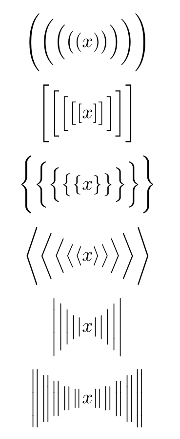

## 省略号

省略号用`\dots`，`\cdots`，`\vdots`，`\ddots`等命令表示。`dots`和`\cdtos`的纵向位置不同，前者一般用于有下标的序列。

```tex
\[ x_1,x_2,\dots ,x_n\quad 1,2,\cdots ,n\quad \vdots\quad \ddots \]
```

效果图：

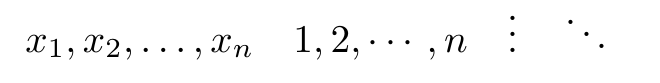


## 矩阵

`amsmath`的`pmatrix`，`bmatrix`，`Bmatrix`，`vmatrix`，`Vmatrix`等环境可以在矩阵的两边加上各种分隔符。


```tex
\[ 
    \begin{pmatrix} a&b\\c&d \end{pmatrix} \quad
    \begin{bmatrix} a&b\\c&d \end{bmatrix} \quad
    \begin{Bmatrix} a&b\\c&d \end{Bmatrix} \quad
    \begin{vmatrix} a&b\\c&d \end{vmatrix} \quad
    \begin{Vmatrix} a&b\\c&d \end{Vmatrix} \quad
\]
```

效果图：

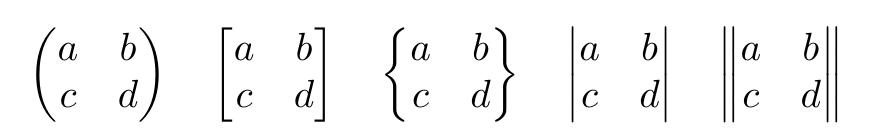


使用`smallmatrix`环境，可以生成行内公式的小矩阵：

```tex
Marry has a little matrix $ (\begin{smallmatrix} a&b\\c&d \end{smallmatrix}) $. 
```

效果图:

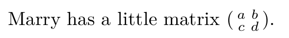


## 多行公式

有的多行公式特别长，我们需要手动为他们换行。有几个公式是一组，我们需要将他们放在一起，还有些类似于分段函数，我们需要给它加上一个左边的花括号。

### 长公式

#### 不对齐

无需对其的唱功是可以使用`multline`环境。

```tex
\begin{multline}
x = a+b+c+{} \\
d+e+f+g
\end{multline}
```

效果图：

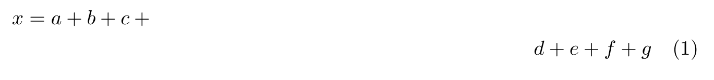


#### 对齐

需要对齐的公式，可以使用`aligned`次环境来实现，它必须包含在数学环境之内。

```tex
\[
    \begin{aligned}
    x = {}& a+b+c{} \\
    & d+e+f+g
    \end{aligned}
\]
```

效果图:

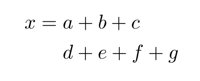

### 公式组

无需对齐的公式组可以使用`gather`环境，需要对其的公式组可以使用`align`环境。他们都带有编号，如果不需要编号可以使用带`*`号的版本。

```tex
\begin{gather}
a = b+c+d \\
x = y+z
\end{gather}

\begin{align}
a &= b+c+d \\
x &= y+z
\end{align}


\begin{gather*}
a = b+c+d \\
x = y+z
\end{gather*}

\begin{align*}
a &= b+c+d \\
x &= y+z
\end{align*}
```

效果图：

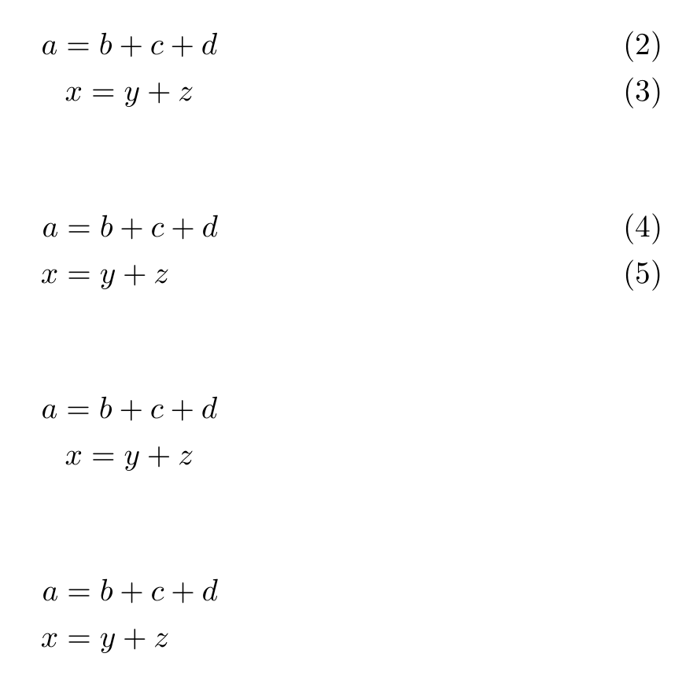

### 分段函数

分段函数可以用`cases`次环境来实现，它必须包含在数学环境之内。

```tex
\[
    y= \begin{cases}
    -x,\quad x\leq 0\\
    x,\quad x\geq  0 
    \end{cases}
\]
```

效果图:

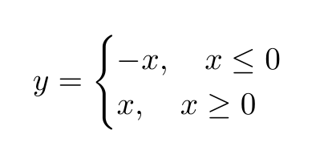


## 插入图片和表格


### 图片


### 表格


